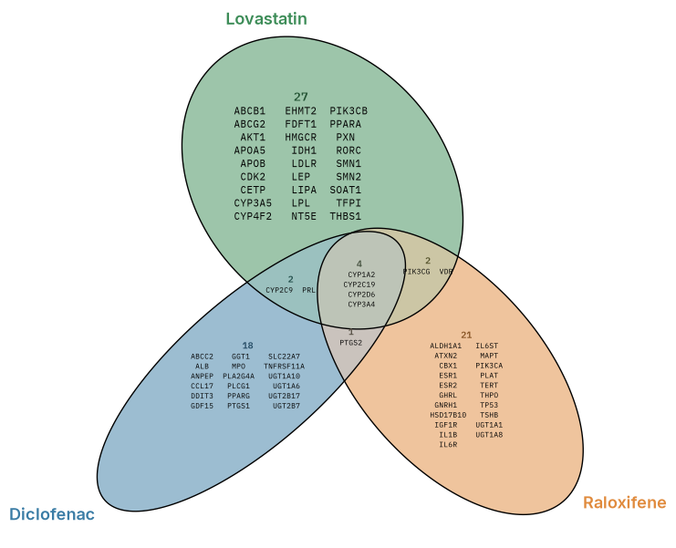
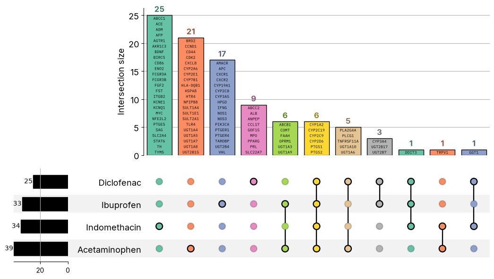

# VISET


<!-- WARNING: THIS FILE WAS AUTOGENERATED! DO NOT EDIT! -->

## Venn / Euler (three drugs)

**Static** (Matplotlib): proportional ellipses, every gene printed and
auto-sized to fit its region.

<details class="code-fold">
<summary>Code</summary>

``` python
import os
import matplotlib.pyplot as plt
from matplotlib import font_manager
from viset import load, eunoia_venn
fp = "Font" if os.path.isdir("Font") else "../Font"
for f in font_manager.findSystemFonts(fontpaths=[fp]):
    font_manager.fontManager.addfont(f)
db = "Drug target sample files/" if os.path.isdir("Drug target sample files") else "../Drug target sample files/"
def L(name, fname): return load(db + fname, "Gene names", name)
ibu = L("Ibuprofen", "2. IBUPROFEN_sample.csv")
ace = L("Acetaminophen", "3. ACETAMINOPHEN_sample.csv")
dic = L("Diclofenac", "12. DICLOFENAC_sample.csv")
ind = L("Indomethacin", "13. INDOMETHACIN_sample.csv")
eunoia_venn([ibu, ace, dic], colors=["#3a7ca5", "#e08a3c", "#3c8c57"], style="round", title="", figsize=(8.5, 7.5))
```

</details>



**Interactive** (Plotly): hover any region to read its members.

<details class="code-fold">
<summary>Code</summary>

``` python
import os
import plotly.io as pio
pio.renderers.default = "notebook_connected"
from matplotlib import font_manager
from viset import load, eunoia_venn_interactive
fp = "Font" if os.path.isdir("Font") else "../Font"
for f in font_manager.findSystemFonts(fontpaths=[fp]):
    font_manager.fontManager.addfont(f)
db = "Drug target sample files/" if os.path.isdir("Drug target sample files") else "../Drug target sample files/"
def L(name, fname): return load(db + fname, "Gene names", name)
ibu = L("Ibuprofen", "2. IBUPROFEN_sample.csv")
ace = L("Acetaminophen", "3. ACETAMINOPHEN_sample.csv")
dic = L("Diclofenac", "12. DICLOFENAC_sample.csv")
ind = L("Indomethacin", "13. INDOMETHACIN_sample.csv")
eunoia_venn_interactive([ibu, ace, dic], colors=["#3a7ca5", "#e08a3c", "#3c8c57"], width=760, height=680, title="")
```

</details>

        <script>
        window.PlotlyConfig = {MathJaxConfig: 'local'};
        if (window.MathJax && window.MathJax.Hub && window.MathJax.Hub.Config) {window.MathJax.Hub.Config({SVG: {font: "STIX-Web"}});}
        </script>
        <script type="module">import "https://cdn.plot.ly/plotly-3.6.0.min"</script>
        

<div style="height:680px; width:760px;">            <script src="https://cdnjs.cloudflare.com/ajax/libs/mathjax/2.7.5/MathJax.js?config=TeX-AMS-MML_SVG"></script><script>if (window.MathJax && window.MathJax.Hub && window.MathJax.Hub.Config) {window.MathJax.Hub.Config({SVG: {font: "STIX-Web"}});}</script>                <script>window.PlotlyConfig = {MathJaxConfig: 'local'};</script>
        <script charset="utf-8" src="https://cdn.plot.ly/plotly-3.6.0.min.js" integrity="sha256-QaOVwtVY0T02VaHrr6pnoHLCwayMJp4O5n4YyaE3rJk=" crossorigin="anonymous"></script>                <div id="fcbaed40-3f28-4fbe-8b91-5f187e941f04" class="plotly-graph-div" style="height:100%; width:100%;"></div>            <script>                window.PLOTLYENV=window.PLOTLYENV || {};                                if (document.getElementById("fcbaed40-3f28-4fbe-8b91-5f187e941f04")) {                    Plotly.newPlot(                        "fcbaed40-3f28-4fbe-8b91-5f187e941f04",                        [{"fill":"toself","fillcolor":"rgba(58,124,165,0.5)","hoverinfo":"skip","line":{"width":0},"mode":"lines","showlegend":false,"x":[-0.5877405446920152,-0.6551218223724122,-0.6479459968361612,-0.569296841040587,-0.4886599448475595,-0.4061148804578538,-0.32174311251971677,-0.23562790127131894,-0.14785423548552945,-0.058508735612368135,0.03232042817738101,0.1245436104979758,0.2180698025074248,0.31280670641329333,0.4086608323302512,0.5055375727858786,0.6033413293805365,0.7019755798425917,0.8013429823365454,0.9013454797711615,1.0018843743052726,1.1028604540076499,1.204174059912229,1.3057252052273993,1.4074136870947127,1.5091391312923674,1.6108011635985617,1.7122994470443968,1.8135338160243277,1.9144043657031302,2.014811548873449,2.1146562728133445,2.2138400110450034,2.3122648703899626,2.4098337325301413,2.5064502912607436,2.6020192015018706,2.696446161254907,2.789637971207166,2.8815026613917594,2.9719495731439833,3.0608894559588675,3.148234527095819,3.233898590787912,3.317797105297113,3.3998472723212485,3.479968126400972,3.5580805870738272,3.634107570632959,3.707974042281175,3.779607120439077,3.8489360990967993,3.915892559572721,3.9804104301181082,4.042426030620599,4.101878169461751,4.1587081658687834,4.212859939321542,4.264280046805406,4.312917742415929,4.3587250295129065,4.401656705423856,4.441670391246343,4.478726606353784,4.512788775846029,4.5438232901540045,4.571799519940877,4.596689853354955,4.61846972583201,4.6371176498976,4.65261521516707,4.664947125598455,4.674101221844221,4.680068466350103,4.6828429657068495,4.682421978100801,4.678805928215051,4.671998384877706,4.662006061061883,4.648838813885713,4.632509652062917,4.613034676298166,4.590433109089399,4.564727264925504,4.535942498132253,4.504107225224042,4.469252865299249,4.431413810237909,4.390627402349973,4.346933897122407,4.300376411065126,4.25100089190867,4.198856066450143,4.143993395849729,4.086467023476625,4.02633372275498,3.9636528375592475,3.8984862226095442,3.8308981913175826,3.7609554487314467,3.6887270170297866,3.6142841684665923,3.5377003806677108,3.459051232322717,3.3784143361296897,3.295869271739984,3.211497503801847,3.125382292553449,3.0376086267676596,2.9559418442693,2.9497328507747893,2.936421650930906,2.9196667703833823,2.8994847419705634,2.8758954885449652,2.8489222857203726,2.8185917544212584,2.784933831080461,2.7479817303862815,2.7077719080295806,2.6643440607037787,2.6177410441484694,2.568008843347097,2.5151965427246337,2.4593562590923552,2.400543104394937,2.3388151112046485,2.2742332103696112,2.206861126705671,2.1367653566446547,2.0640150639262442,1.9886820572462325,1.910840671047235,1.8305677357163672,1.747942458375955,1.6630463930812125,1.5759633067097907,1.4867791566100363,1.3955819490399604,1.302461679562593,1.2075102510895972,1.1108213770237212,1.0124904620495085,1.006106290504003,1.005349229558969,0.9966857018914466,0.9852284747209792,0.9709888505783324,0.9539808887090926,0.934221367820764,0.9117298009839301,0.8865283685770278,0.8586419480886702,0.8280980694141631,0.7949268552508597,0.7591610658016448,0.7208359721150641,0.6799894156899695,0.6366617041673903,0.5908955889787917,0.5427362429943328,0.49223118601706073,0.4394302698817496,0.38438559649851367,0.3271514955010657,0.2677844348397498,0.20634302078154132,0.14288787125017688,0.0774816232767348,0.010188821240926238,-0.05892412783238843,-0.12978902132842496,-0.20233592064712003,-0.2764932257089372,-0.3521877569112535,-0.4293448072824235,-0.507888246789908],"y":[-4.140397987726407,-4.1764327207834295,-4.182774975362497,-4.248036130729394,-4.31080655700274,-4.371024302604871,-4.428629941704946,-4.4835666189224295,-4.535780131283479,-4.585218943122106,-4.631834260585981,-4.675580083790498,-4.7164132440716795,-4.754293441239076,-4.789183288279252,-4.821048363509851,-4.849857203129011,-4.875581390622335,-4.898195534411149,-4.917677320006566,-4.934007517460065,-4.947170011165815,-4.957151807311254,-4.963943063679414,-4.967537074747758,-4.967930294039922,-4.965122334125715,-4.959115966621118,-4.949917114737707,-4.9375348532826475,-4.921981416109281,-4.903272136512475,-4.881425491932111,-4.856463036897855,-4.828409403029161,-4.797292284134107,-4.763142376604753,-4.7259933943183,-4.685881994131284,-4.642847760978418,-4.596933163169103,-4.5481835151345305,-4.496646917823034,-4.442374251249509,-4.3854190552861265,-4.32583755201407,-4.26368854141541,-4.199033341768461,-4.131935774746614,-4.062462053659635,-3.990680738750177,-3.916662670138555,-3.8404809007675222,-3.762210599544721,-3.681929021540361,-3.5997153887779287,-3.5156508380801252,-3.429818331661897,-3.3423025826246313,-3.2531899431974463,-3.1625683674842886,-3.0705272848040632,-2.9771575251848272,-2.882551244857984,-2.786801799598413,-2.690003677669244,-2.5922524178654722,-2.493644490304666,-2.394277199569421,-2.2942486102015547,-2.1936574423939756,-2.0926029676825575,-1.99118491208859,-1.8895033667118124,-1.787658675971704,-1.685751348200517,-1.5838819513351492,-1.4821510235101751,-1.3806589612991385,-1.2795059228570036,-1.1787917310626082,-1.078615776661115,-0.9790769288570456,-0.8802734161049894,-0.7823027516037993,-0.6852616140873007,-0.589245765867906,-0.49434997833080807,-0.40066789037294903,-0.3082919562489561,-0.21731334871359387,-0.12782183981247464,-0.03990575617857495,0.04634814762763462,0.1308547412722536,0.21353063040666065,0.29429422372273883,0.37306581490926227,0.44976767205886325,0.5243240898220964,0.5966615011661478,0.6667085146277376,0.734395996269507,0.7996571516364046,0.8624275779097506,0.9226453235118814,0.9802509626119562,1.0351876398294397,1.0874011521904894,1.1325909873216577,1.06312426978044,0.9532479649155565,0.8438555231063791,0.7350549107163378,0.6269534831612535,0.519657940205855,0.413274162051005,0.3079071348278948,0.20366084628991565,0.10063816660336933,-0.0010592187077573811,-0.10133095032282391,-0.2000780845315031,-0.297203152838426,-0.3926103184253744,-0.48620542085476437,-0.5778960878283552,-0.6675918394953779,-0.7552041555077604,-0.8406465718776754,-0.923834762933927,-1.004686638179498,-1.0831224018961958,-1.1590646500021986,-1.232438437107282,-1.3031713510186247,-1.3711935872466139,-1.4364380160600714,-1.4988402495414785,-1.5583387086422018,-1.6148746678859762,-1.6683923298747114,-1.718838892343717,-1.7218639994294218,-1.733231730225759,-1.8212331528098158,-1.9091388056308798,-1.9968619341284803,-2.084315970006662,-2.171414598289209,-2.258071876528936,-2.34420227206059,-2.4297207961113028,-2.514543041053491,-2.598585307064729,-2.6817646468312315,-2.763998977306562,-2.845207139316278,-2.925308994415479,-3.0042254844934515,-3.081878736081796,-3.1581921199590735,-3.233090303304868,-3.30649939126082,-3.378346934381204,-3.4485620180398993,-3.517075351837354,-3.583819329205232,-3.648728072109895,-3.7117375279099516,-3.77278552151032,-3.8318117926151327,-3.8887580925852827,-3.9435682216913275,-3.9961881036192946,-4.046565785470682,-4.094651571872907],"type":"scatter"},{"fill":"toself","fillcolor":"rgba(224,138,60,0.5)","hoverinfo":"skip","line":{"width":0},"mode":"lines","showlegend":false,"x":[-4.072059859036075,-4.0749748539911375,-4.074414130745994,-4.070378240643607,-4.062871162294017,-4.051900309024917,-4.037476506529914,-4.019613985417949,-3.9983303737627134,-3.9736466822014913,-3.945587266682254,-3.9141798210130796,-3.8794553321586713,-3.8414480802403554,-3.8166049611555204,-3.811200809179412,-3.7457945612059698,-3.6785017517195806,-3.609388802646266,-3.5385239091502294,-3.465977017282115,-3.3918197122202978,-3.3161251810179815,-3.238968123196231,-3.1604246836887464,-3.080572385786639,-2.9994900193797216,-2.917257618604766,-2.8339563202844724,-2.7496683415757284,-2.6644768607603178,-2.578465957640277,-2.491720509229766,-2.4043261226998434,-2.3163690459714994,-2.2279360932098493,-2.1391145181642637,-2.0499919918166265,-1.9606564608203039,-1.8711960878954992,-1.781699162422286,-1.6922540035830602,-1.6029488858567342,-1.513871942161189,-1.4251110818968877,-1.3367539015399084,-1.2488875952349767,-1.1615988802896604,-1.074973900316821,-0.9890981358276472,-0.9040563446270093,-0.8199324500547513,-0.7368094739304647,-0.6547694471465215,-0.573893327711688,-0.5326795917736158,-0.5100928884731397,-0.42804271399842353,-0.3441441994892225,-0.2584801357971296,-0.17113506466017814,-0.08219518929587455,0.008251729906930017,0.10011642009152322,0.19330823004378228,0.2877351823462382,0.3833041000379458,0.47992065876854806,0.5774895134581461,0.675914380253686,0.7750981110347643,0.8749428424252406,0.9753500255955592,1.0762205752743617,1.1774549442542925,1.2789532277001276,1.3806152525557414,1.4823407042039767,1.5840291786207095,1.6855803313864604,1.7868939372910395,1.8878700095428362,1.9884089115275279,2.0884114015115633,2.1877788114560976,2.286413061918153,2.3842168185128108,2.481093558968438,2.5769476774348155,2.671684581340684,2.7652107808007136,2.8574339631213084,2.9482631269110575,2.9559418368352786,2.9595872345579997,2.9659750792397395,2.968890081645383,2.968329358400239,2.9642934682978526,2.9567863899482623,2.945815536679162,2.9313917267335787,2.9135292056216135,2.892245601416959,2.867561909855737,2.8395024943364993,2.8080950412167445,2.773370559812917,2.735363307894601,2.6941107916845217,2.649653736056222,2.602036002577676,2.551304582060708,2.4975095498575106,2.440703998805417,2.3809439721716776,2.318288456202878,2.252799283267392,2.1845410871518984,2.113581221104993,2.0399897280348673,1.9638392138494387,1.8852048474563494,1.8041642266525164,1.720797325970067,1.6351864221705332,1.5474159973873034,1.457572679520978,1.3657451230300799,1.27202395677699,1.176501664818658,1.0792725268019572,0.9804324913038149,0.8800790938748255,0.778311389984025,0.6752297911061182,0.5709360423697367,0.46553305864466576,0.35912486493719964,0.251816477180852,0.14371378302706628,0.03492347478999047,-0.07444707721339316,-0.1842899513231382,-0.29449673414097877,-0.4049586769925222,-0.5155667555318937,-0.6262118187533483,-0.7367846783982381,-0.8471761983619794,-0.9572774437056646,-1.0669797626124486,-1.1761748906956777,-1.2847550553070173,-1.392613109646903,-1.4996426072703466,-1.605737928746806,-1.7107943636165723,-1.8147082445012197,-1.917377006708251,-2.018699337242709,-2.1185752344118223,-2.216906149386035,-2.313595023451911,-2.4085464519249067,-2.501666721402274,-2.59286392897235,-2.6820480790721044,-2.769131165443526,-2.854027230738269,-2.936652508078681,-3.0169254434095487,-3.094766829608546,-3.170099836288558,-3.2428501290069685,-3.3129458990679845,-3.380317982731925,-3.444899883566962,-3.5066278767572507,-3.565441031454669,-3.6212813150869474,-3.6740936157094106,-3.723825816510783,-3.7704288330660924,-3.8138566803918943,-3.854066502748595,-3.8910186034427747,-3.9246765342341527,-3.9550070580826864,-3.981980260907279,-4.005569514332877,-4.025751542745696,-4.0425064232932195,-4.055817630587684,-4.065672014354335],"y":[1.6031959210714488,1.4925200049957423,1.3817957644542842,1.2711324547609477,1.1606393014272838,1.0504253437003284,0.9405993451556354,0.8312696893891482,0.7225442757090716,0.6145304073771625,0.5073346798500209,0.40106286902038146,0.29581987161246825,0.1917095338186412,0.12975610841123153,0.13544035006372024,0.20034909296838332,0.2633585562190204,0.3244065423688083,0.3834328134736209,0.4403791134437709,0.49518925000039626,0.5478091244777827,0.5981868137797504,0.6462725927313953,0.6920190160354762,0.7353809331735759,0.7763155480107455,0.8147824709495692,0.8507437263807445,0.8841638420900493,0.9150098269066005,0.9432512377580791,0.9688602094730525,0.9918114622315555,1.012082353719154,1.029652879126945,1.0445056860527187,1.0566261266550212,1.0660022427519946,1.072624773271957,1.0764871840557246,1.0775856678566127,1.075919136889854,1.0714892377337604,1.0643003438791423,1.0543595408281474,1.0416766484460025,1.0262641837081103,1.0081373457988887,0.987314038463512,0.9638148029526858,0.937662825473228,0.9088839297374873,0.8775065024575381,0.8599382792791515,0.8774585728725581,0.9370400761446147,0.9939952721079974,1.048267938681522,1.099804528542438,1.1485541765770106,1.1944687743863254,1.2375030149897723,1.2776144151767879,1.3147633974632411,1.3489133049925952,1.380030423887649,1.4080840577563434,1.4330465127905994,1.4548931573709636,1.4736024369677692,1.4891558741411357,1.5015381281456142,1.5107369800290256,1.5167433549842029,1.5195513148984103,1.5191580956062465,1.5155640845379024,1.5087728281697421,1.4987910245737224,1.4856285308679729,1.4692983408650546,1.4498165552696376,1.427202411480823,1.4014782239874988,1.3726693769177585,1.3408043091377406,1.3059144620975642,1.2680342649301677,1.2272011046489864,1.183455281444469,1.1368399639805942,1.1325909947237163,1.1733760019024997,1.283894360550323,1.394570269175449,1.5052945171674876,1.6159578194102435,1.7264509727439075,1.8366649379214435,1.9464909364661365,2.055820584782043,2.1645459984621196,2.2725598667940288,2.379755601771751,2.4860274051508098,2.5912704100093036,2.69538074035255,2.7982556675752788,2.899793655165115,2.9998945002636104,3.098459423073211,3.1953911413630633,3.290593997128883,3.3839740385493426,3.47543911684362,3.5648989533266215,3.6522652735194354,3.7374518518528133,3.82037462342588,3.900951751061359,3.979103714712539,4.054753385969081,4.127826117463985,4.198249780126491,4.265954882391372,4.330874607451835,4.392944887765327,4.45210446465818,4.508294962831417,4.561460920163074,4.6115498696645885,4.658512376733699,4.702302106209674,4.742875837274471,4.78019352305738,4.814218335338512,4.844916709252277,4.872258335836807,4.89621623653976,4.916766763218322,4.933889642842689,4.947567977496067,4.957788259275833,4.96454041499702,4.9678177689394145,4.967617087551036,4.9639385794481425,4.956785865612903,4.946166001745143,4.932089478262344,4.914570183046737,4.893625408895889,4.869275816269794,4.841545440741458,4.810461655743995,4.776055120416561,4.738359809406677,4.697412908562103,4.653254837282577,4.60592916656343,4.555482604094425,4.5019649421056895,4.445428982861915,4.385930523761192,4.323528290279785,4.258283861466327,4.190261625238338,4.119528711326995,4.046154924221912,3.970212676115909,3.8917769123992114,3.8109250371536403,3.727736838646808,3.6422944297274737,3.5546821137150912,3.4649863620480685,3.3732956950744777,3.2797005926450877,3.1842934270581393,3.0871683587512164,2.9884212245425372,2.8881494929274707,2.786452107616344,2.6834294279297977,2.5791831393918185,2.4738161121687083,2.3674323340138583,2.2601367910584598,2.1520353635033755,2.043234751113334,1.9338423093041568,1.8239660044392734,1.7137142722686916],"type":"scatter"},{"fill":"toself","fillcolor":"rgba(60,140,87,0.5)","hoverinfo":"skip","line":{"width":0},"mode":"lines","showlegend":false,"x":[-4.682576689203419,-4.682818892677464,-4.680249805827774,-4.674871969302334,-4.666690687914528,-4.655714038093723,-4.641952852984108,-4.62542071499411,-4.6061339334446565,-4.584111544569172,-4.559375281711258,-4.53194955297295,-4.501861433764137,-4.469140614648499,-4.43381937899176,-4.3959325880605356,-4.35551763631884,-4.3126144067246095,-4.267265233476795,-4.219514879663624,-4.16941046275679,-4.117001439710297,-4.062339517553486,-4.00547864594046,-3.9464749426442762,-3.8853866414028784,-3.8222740174132963,-3.757199364979901,-3.690226900656857,-3.62142271854464,-3.55085471578423,-3.478592547853627,-3.4047075168091436,-3.3292725414830824,-3.252362060626187,-3.1740519882041593,-3.094419601638951,-3.0135434822041174,-2.931503455420174,-2.8483804792958876,-2.7642565847236296,-2.6792147935229917,-2.5933390364843985,-2.5067140490609785,-2.419425334115662,-2.3315590278107305,-2.243201847453751,-2.15444098718945,-2.0653640434939047,-1.9760589257675787,-1.8866137743789335,-1.7971168489057203,-1.7076564759809156,-1.618320944984593,-1.5291984111863752,-1.4403768435913702,-1.3519438833791395,-1.2639868066507955,-1.1765924275714537,-1.0898469791609426,-1.0038360685903212,-0.9186445952254911,-0.8343566165167471,-0.7510553181964537,-0.6688229099709173,-0.6551218212443968,-0.7245297835070272,-0.7989726246196409,-0.8712010563213011,-0.9411438063580175,-1.0087318301993986,-1.0738984451491018,-1.1365793377954145,-1.19671263851706,-1.254239010890164,-1.3091016740399977,-1.3612464994985243,-1.4106220186549803,-1.4571795047122618,-1.5008730099398275,-1.5416594178277632,-1.5794984728891035,-1.6143528402644773,-1.6461881057221075,-1.6749728725153585,-1.7006787166792532,-1.7232802838880201,-1.7427552596527716,-1.759084428926148,-1.7722516686517378,-1.7822439924675604,-1.789051543255486,-1.7894747883874556,-1.8843961612183233,-1.9861638725597044,-2.086517262538113,-2.1853572980362554,-2.282586436052956,-2.3781087280112883,-2.471829894264378,-2.5636574507552763,-2.6535007760721823,-2.7412711934048315,-2.826882104654946,-2.9102490053373953,-2.9912896261412283,-3.0699239925343176,-3.1460744992691656,-3.219665999789872,-3.2906258583861967,-3.3588840545016905,-3.4243732274371763,-3.487028743405976,-3.5467887700397154,-3.6035943285423895,-3.657389360745587,-3.708120773811974,-3.7557385072905203,-3.8001955703694006,-3.8166049525934835,-3.8746559501487394,-3.936097364206948,-3.995464424868264,-4.052698525865711,-4.107743199248947,-4.160544122834839,-4.21104917236153,-4.259208518345989,-4.304974633534588,-4.348302352507748,-4.389148908932842,-4.427473995168842,-4.463239792068638,-4.496410998781361,-4.526954877455868,-4.554841297944225,-4.580042730351128,-4.602534297187962,-4.62229381807629,-4.63930177994553,-4.653541404088177,-4.664998631258644,-4.673662158926167,-4.6795234412747995],"y":[-1.8910900162787012,-1.9788577216000132,-2.066374096486049,-2.15355278125711,-2.240307729157882,-2.3265533330173067,-2.412204484853225,-2.4971766354770235,-2.5813859509558252,-2.664749312612491,-2.7471844585866503,-2.8286100285381846,-2.9089456754059366,-2.9881121026606134,-3.066031198415237,-3.142626050326305,-3.217821079704242,-3.2915420787663034,-3.363716285142379,-3.4342724787325434,-3.503141026410537,-3.5702539639801554,-3.635545063230472,-3.6989498766393236,-3.7604058491320185,-3.819852310630756,-3.8772306176156572,-3.9324841233224443,-3.98555831930347,-4.036400805625396,-4.084961424979644,-4.131192247781234,-4.1750476466745905,-4.216484348687606,-4.255461450132804,-4.291940498563724,-4.32588548532434,-4.357262905153709,-4.38604180834003,-4.412193778368907,-4.435693021330314,-4.456516328665691,-4.4746431665749125,-4.490055631312805,-4.5027385236949495,-4.512679326745944,-4.5198682206005625,-4.524298119756656,-4.525964650723415,-4.524866166922527,-4.521003756138759,-4.514381225618797,-4.505005109521823,-4.492884668919521,-4.4780318545431665,-4.460461336585956,-4.440190445098358,-4.417239192339855,-4.391630220624881,-4.363388809773403,-4.332542824956851,-4.299122709247547,-4.263161446365791,-4.224694530877548,-4.183759908589797,-4.17643272450872,-4.115087497446018,-4.045040483984428,-3.9727030726403765,-3.8981466548771433,-3.8214447977275423,-3.742673206541019,-3.6619096132249407,-3.5792337240905336,-3.4947271304459147,-3.408473226639705,-3.3205571430058054,-3.231065634104686,-3.140087026569324,-3.047711092445331,-2.954029004487472,-2.859133216950374,-2.7631173687309794,-2.666076231214481,-2.5681055667132906,-2.4693020539612345,-2.369763206157165,-2.269587251755672,-2.1688730599612764,-2.0677200215191416,-1.966227959308105,-1.8644970314831308,-1.8525736363858751,-1.8152118357152514,-1.7714221062392763,-1.7244595917195849,-1.6743706422180704,-1.621204684886413,-1.5650141941637568,-1.505854617270904,-1.4437843369574122,-1.3788646118969492,-1.3111595021814875,-1.2407358395189814,-1.1676631154746584,-1.0920134442181162,-1.013861480566936,-0.933284352931457,-0.8503615813583902,-0.7651750030250124,-0.6778086828321985,-0.5883488388986162,-0.49688376805491963,-0.4035037266344599,-0.30830086341805973,-0.2113691451282076,-0.11280422976918736,-0.012703384670691875,0.08883460291914425,0.1297560972838827,0.06869636901907406,0.00018303522161922103,-0.070032048437076,-0.14187959155746022,-0.2152886795134119,-0.2901868628592066,-0.36650024673648396,-0.44415349832482853,-0.523069988402801,-0.6031718435020021,-0.6843800055117182,-0.7666143359870485,-0.8497936757535509,-0.933835941764789,-1.0186581867069773,-1.1041767107576899,-1.1903071062893442,-1.2769643845290712,-1.3640630128116182,-1.4515170486897997,-1.5392401771874002,-1.6271458300084642,-1.715147252592521,-1.803157600972133],"type":"scatter"},{"fill":"toself","fillcolor":"rgba(141,131,112,0.5)","hoverinfo":"skip","line":{"width":0},"mode":"lines","showlegend":false,"x":[-0.5100928840054215,-0.5326795873058976,-0.49426094040405166,-0.4159508679820241,-0.3390403908504189,-0.2636054155243577,-0.1897203844798745,-0.11745821282398117,-0.04689021378886116,0.021913968323355792,0.08888643264639962,0.1539610888050853,0.21707370906937706,0.2781620140360652,0.33716571733224976,0.3940265852199851,0.4486885073767959,0.5010975341485797,0.5512019510554134,0.5989523048685848,0.6443014743911086,0.6872047077106296,0.727619659452325,0.7655064466582595,0.8008276823149978,0.8335485051559268,0.8636366243647395,0.8910623493777572,0.9157986122356712,0.9378210011111556,0.9571077863858997,0.9736399243758975,0.9874011094855129,0.9983777593063174,1.0065590406941234,1.0119368734942733,1.0145059603439628,1.0142637605952083,1.011210512666589,1.0061062949882804,1.0124904590832053,1.110821374057418,1.2075102555738746,1.3024616765962898,1.3955819460736572,1.4867791536437331,1.575963311194068,1.6630463901149093,1.7479424554096519,1.830567732750064,1.9108406680809318,1.9886820542799293,2.0640150684105216,2.1367653536783515,2.206861131189948,2.274233207403308,2.338815115688926,2.400543101428634,2.459356256126052,2.5151965397583305,2.5680088403807937,2.617741041182166,2.6643440577374755,2.7077719050632774,2.7479817274199783,2.784933828114158,2.818591758905536,2.84892229020465,2.875895485578662,2.89948473900426,2.919666767417079,2.9364216479646026,2.9497328552590667,2.9559418413029968,2.948263123928195,2.857433960138446,2.765210777817851,2.671684585808402,2.5769476819025336,2.481093555985576,2.3842168155299484,2.2864130589352905,2.1877788084732352,2.0884114059792815,1.9884089085446655,1.8878700140105544,1.7868939343081771,1.685580328403598,1.584029175637847,1.4823407012211143,1.3806152570234596,1.2789532247172652,1.1774549412714301,1.0762205722914993,0.9753500226126968,0.8749428394423782,0.7750981080519019,0.6759143772708236,0.5774895104752837,0.47992065578568566,0.3833040970550834,0.2877351793633758,0.19330822706091988,0.10011641710866082,0.008251726924067615,-0.08219519227873695,-0.17113506764304054,-0.258480138779992,-0.3441442024720849,-0.42804271698128593],"y":[0.8774585716963585,0.8599382743776616,0.8435615145207223,0.8070824698150929,0.7681053646446045,0.7266686626315888,0.6828132637382325,0.6365824409366425,0.5880218215823945,0.537179331535178,0.48410514300473295,0.42885162984736525,0.3714733303130444,0.3120268613637265,0.2505708925963219,0.18716607546218,0.12187497993715368,0.05476204236753546,-0.014106505310458317,-0.0846626989006225,-0.15683690527669825,-0.23055790061346926,-0.3057529337166969,-0.38234778935305513,-0.46026688138238825,-0.5394333123623554,-0.6197689517795268,-0.7011945254563514,-0.7836296677052204,-0.8669930330871765,-0.9512023448406879,-1.0361745029150669,-1.1218256473004047,-1.2080712548851196,-1.294826206511182,-1.3820048875569526,-1.4695212661682788,-1.5572889677643005,-1.6452213830708686,-1.7218639969288532,-1.7188388935684387,-1.668392331099433,-1.6148746691106979,-1.5583387098669235,-1.4988402507662002,-1.436438017284793,-1.3711935884713355,-1.3031713522433463,-1.2324384383320037,-1.1590646512269203,-1.0831224031209175,-1.0046866319536392,-0.9238347641586486,-0.8406465656518165,-0.7552041567324821,-0.6675918407200996,-0.5778960890530769,-0.486205422079486,-0.3926103196500961,-0.2972031540631477,-0.20007808575622477,-0.10133095154754557,-0.0010592199324790386,0.10063817282922827,0.203660845065194,0.3079071336031731,0.4132741608262833,0.5196579389811333,0.6269534893871125,0.7350549094916161,0.8438555293322381,0.9532479636908349,1.0631242685557183,1.132590986096936,1.1368399628043946,1.1834552802682694,1.2272011034727868,1.268034263753968,1.3059144609213647,1.340804307961541,1.3726693831921395,1.4014782228112992,1.4272024103046235,1.449816554093438,1.469298339688855,1.4856285371423539,1.4987910308481034,1.5087728269935425,1.5155640833617028,1.519158094430047,1.5195513137222108,1.5167433538080033,1.5107369863034066,1.5015381344199952,1.4891558729649361,1.4736024357915696,1.454893156194764,1.4330465116143998,1.4080840565801438,1.3800304227114495,1.3489133038163956,1.3147633962870415,1.2776144140005883,1.2375030138135727,1.1944687806607064,1.1485541828513917,1.0998045273662385,1.0482679375053223,0.9939952709317978,0.9370400749684151],"type":"scatter"},{"fill":"toself","fillcolor":"rgba(59,132,126,0.5)","hoverinfo":"skip","line":{"width":0},"mode":"lines","showlegend":false,"x":[-1.7813145625519553,-1.7894747885989943,-1.7890515434670249,-1.7822439926790992,-1.7722516688632766,-1.7590844291376868,-1.7427552598643103,-1.723280284099559,-1.700678716890792,-1.6749728727268973,-1.6461881059336463,-1.6143528404760161,-1.5794984731006423,-1.541659418039302,-1.5008730101513663,-1.4571795049238006,-1.410622018866519,-1.361246499710063,-1.3091016742515365,-1.2542390111017028,-1.1967126387285987,-1.1365793380069533,-1.0738984453606406,-1.0087318304109374,-0.9411438065695563,-0.8712010565328399,-0.7989726248311797,-0.724529783718566,-0.6551218214559356,-0.5877405437755385,-0.5078882458734313,-0.42934480636594685,-0.3521877559947768,-0.2764932247924605,-0.20233591973064335,-0.12978902041194829,-0.058924126915911756,0.01018882215740291,0.07748162419321147,0.14288787216665355,0.206343021698018,0.26778443575622646,0.3271514964175424,0.38438559741499034,0.4394302707982263,0.4922311869335374,0.5427362439108094,0.5908955898952684,0.636661705083867,0.6799894166064462,0.7208359730315408,0.7591610667181214,0.7949268561673364,0.8280980703306398,0.8586419490051469,0.8865283694935044,0.9117298019004068,0.9342213687372407,0.9539808896255693,0.9709888514948091,0.9852284756374559,0.9966857028079232,1.0053492304754457,1.0061062914204797,0.9126145583462915,0.8112922278118333,0.708623465604802,0.6047095921707353,0.49965315730096904,0.39355783582450954,0.28652833820106594,0.17867028386118022,0.07009011179926006,-0.03910500883338841,-0.14880732774017247,-0.2589085730838576,-0.3693001004981795,-0.47987295269248875,-0.5905180159139434,-0.7011260944533149,-0.8115880373048583,-0.9217948201226989,-1.031637694232444,-1.1410082536864081,-1.2497985544729033,-1.357901248626689,-1.4652096363830367,-1.5716178300905028,-1.6770208138155738],"y":[-1.8557855630547575,-1.8525736326605848,-1.8644970277578405,-1.9662279555828146,-2.0677200177938513,-2.168873056235986,-2.2695872480303816,-2.3697632024318747,-2.469302050235944,-2.5681055629880003,-2.6660762274891905,-2.763117365005689,-2.8591332132250837,-2.9540290007621817,-3.0477110887200407,-3.1400870228440336,-3.231065630379396,-3.320557139280515,-3.408473222914415,-3.4947271267206244,-3.5792337203652433,-3.6619096094996504,-3.7426732028157286,-3.821444794002252,-3.898146651151853,-3.972703068915086,-4.0450404802591375,-4.115087493720727,-4.1764327207834295,-4.140397987726407,-4.094651571872907,-4.046565785470682,-3.9961881036192946,-3.9435682216913275,-3.8887580925852827,-3.8318117926151327,-3.77278552151032,-3.7117375279099516,-3.648728072109895,-3.583819329205232,-3.517075351837354,-3.4485620180398993,-3.378346934381204,-3.30649939126082,-3.233090303304868,-3.1581921199590735,-3.081878736081796,-3.0042254844934515,-2.925308994415479,-2.845207139316278,-2.763998977306562,-2.6817646468312315,-2.598585307064729,-2.514543041053491,-2.4297207961113028,-2.34420227206059,-2.258071876528936,-2.171414598289209,-2.084315970006662,-1.9968619341284803,-1.9091388056308798,-1.8212331528098158,-1.733231730225759,-1.7218639994294218,-1.7661645630628637,-1.8103226343423895,-1.8512695351869635,-1.8889648461968473,-1.9233713815242819,-1.9544551665217451,-1.9821855420500807,-2.0065351346761755,-2.027479908827024,-2.0449992040426306,-2.05907572752543,-2.06969559139319,-2.0768483052284292,-2.080526813331323,-2.080727494719701,-2.077450140777307,-2.0706979850561194,-2.0604777032763533,-2.0467993686229757,-2.029676488998609,-2.009125962320047,-1.9851680616170935,-1.9578264350325636,-1.9271280611187986,-1.893103248837667],"type":"scatter"},{"fill":"toself","fillcolor":"rgba(142,139,73,0.5)","hoverinfo":"skip","line":{"width":0},"mode":"lines","showlegend":false,"x":[-3.8112008091794123,-3.816604961155521,-3.8001955714808573,-3.755738508401977,-3.708120774923431,-3.6573893618570437,-3.603594329653846,-3.546788771151172,-3.4870287445174326,-3.424373228548633,-3.3588840630637278,-3.2906258594976534,-3.2196660009013285,-3.1460745003806223,-3.0699239936457743,-2.991289627252685,-2.910249006448852,-2.8268821057664026,-2.741271201966869,-2.653500777183639,-2.563657451866733,-2.471829895375835,-2.378108729122745,-2.282586437164413,-2.185357299147712,-2.08651726364957,-1.986163873671161,-1.88439616232978,-1.7894747894989123,-1.7926675942526926,-1.7930885744081606,-1.790314075051414,-1.7843468379961123,-1.7751927417503466,-1.762860823868381,-1.7473632585989107,-1.7287153345333208,-1.7069354620562662,-1.6820451286421885,-1.6540688988553156,-1.6230343845473398,-1.5889722150550951,-1.5519159999476542,-1.5119023141251673,-1.4689706382142176,-1.4231633511172403,-1.3745256555067171,-1.3231055480228533,-1.2689537745700945,-1.2121237781630625,-1.1526716393219103,-1.0906560388194193,-1.026138168274032,-0.9591817077981104,-0.8898527291403879,-0.8182196584330668,-0.7443531793342699,-0.6683261957751383,-0.5902137351022829,-0.5326795917736162,-0.5738933277116884,-0.654769447146522,-0.7368094739304651,-0.8199324500547518,-0.9040563446270098,-0.9890981358276476,-1.0749739003168215,-1.1615988802896609,-1.2488875952349772,-1.3367539015399088,-1.4251110818968882,-1.5138719421611895,-1.6029488858567347,-1.6922540035830607,-1.7816991624222864,-1.8711960878954996,-1.9606564608203043,-2.049991991816627,-2.139114518164264,-2.2279360932098498,-2.3163690459715,-2.404326122699844,-2.4917205092297663,-2.5784659576402773,-2.664476860760318,-2.749668341575729,-2.833956320284473,-2.9172576186047663,-2.999490019379722,-3.0805723857866396,-3.160424683688747,-3.2389681231962313,-3.316125181017982,-3.391819712220298,-3.4659770172821154,-3.53852390915023,-3.6093888026462664,-3.678501751719581,-3.74579456120597],"y":[0.13544034869802068,0.12975610704553198,0.08883460523021292,-0.012703382359623205,-0.11280422745811869,-0.21136914281713892,-0.30830086110699106,-0.4035037243233912,-0.49688376574385096,-0.5883488365875476,-0.6778086805211299,-0.7651750007139437,-0.8503615790473216,-0.9332843506203883,-1.0138614782558673,-1.0920134419070475,-1.1676631131635897,-1.2407358372079127,-1.3111594998704188,-1.3788646095858805,-1.4437843346463435,-1.5058546149598353,-1.565014191852688,-1.6212046825753443,-1.6743706399070017,-1.7244595894085162,-1.7714221039282076,-1.8152118334041827,-1.8525736340748065,-1.7626276323066943,-1.6607203045355075,-1.558875613795399,-1.4571940684186213,-1.3557760128246539,-1.2547215381132357,-1.1541303703056567,-1.0541017809377902,-0.9547344902025454,-0.8561265626417391,-0.7583753028379672,-0.6615771809087985,-0.5658277356492274,-0.47122145532238413,-0.37785169570314814,-0.28581061302292277,-0.1951890373097651,-0.10607639788258005,-0.018560648845314276,0.06727185757291387,0.15133640827071737,0.23355004103314947,0.31383161903750967,0.3921019202603109,0.4682836896313436,0.5423017582429654,0.6140830731524236,0.6835567942394025,0.7506543612612493,0.8153095609081991,0.8599382779134519,0.8775065010918386,0.9088839283717878,0.9376628241075284,0.9638148015869863,0.9873140370978124,1.0081373444331891,1.0262641823424108,1.041676647080303,1.0543595394624479,1.0643003425134427,1.0714892363680608,1.0759191355241544,1.0775856664909131,1.076487182690025,1.0726247719062574,1.066002241386295,1.0566261252893216,1.044505684687019,1.0296528777612455,1.0120823523534543,0.9918114608658559,0.968860208107353,0.9432512363923795,0.9150098255409009,0.8841638407243497,0.8507437250150449,0.8147824695838697,0.776315546645046,0.7353809318078763,0.6920190146697767,0.6462725913656957,0.5981868124140508,0.5478091231120832,0.4951892486346967,0.44037911207807134,0.38343281210792135,0.32440654100310873,0.2633585548533208,0.20034909160268377],"type":"scatter"},{"fill":"toself","fillcolor":"rgba(114,134,104,0.5)","hoverinfo":"skip","line":{"width":0},"mode":"lines","showlegend":false,"x":[-1.790314074151496,-1.7930885735082427,-1.7926675933527747,-1.7894747885989943,-1.7813145625519553,-1.6770208138155738,-1.5716178300905028,-1.4652096363830367,-1.357901248626689,-1.2497985544729033,-1.1410082536864081,-1.031637694232444,-0.9217948201226989,-0.8115880373048583,-0.7011260944533149,-0.5905180159139434,-0.47987295269248875,-0.3693001004981795,-0.2589085730838576,-0.14880732774017247,-0.03910500883338841,0.07009011179926006,0.17867028386118022,0.28652833820106594,0.39355783582450954,0.49965315730096904,0.6047095921707353,0.708623465604802,0.8112922278118333,0.9126145583462915,1.0061062914204797,1.0112105128240785,1.0142637607526979,1.0145059642267427,1.0119368773770532,1.006559040851613,0.998377759463807,0.9874011096430024,0.9736399245333871,0.9571077865433892,0.9378210049939355,0.915798616118451,0.8910623532605371,0.8636366245222291,0.8335485053134164,0.8008276787471971,0.7655064505410394,0.7276196596098146,0.6872047078681192,0.6443014782738885,0.5989523050260743,0.5512019512129029,0.5010975343060693,0.44868851125957576,0.394026589102765,0.33716571748973934,0.2781620141935548,0.21707371295215694,0.15396108896257488,0.08888643652917949,0.021913972206135668,-0.04689020990608128,-0.11745821266649159,-0.18972038059709462,-0.2636054116415778,-0.33904039441821965,-0.4159508678245345,-0.4942609402465621,-0.5326795908736983,-0.590213734202365,-0.6683261948752204,-0.744353178434352,-0.8182196575331488,-0.88985272824047,-0.9591817068981925,-1.0261381673741141,-1.0906560379195014,-1.1526716384219924,-1.2121237772631446,-1.2689537736701766,-1.3231055471229354,-1.3745256546067992,-1.4231633502173224,-1.4689706373142997,-1.5119023132252494,-1.5519159990477362,-1.5889722141551772,-1.6230343910980025,-1.6540688979553977,-1.6820451277422706,-1.7069354611563483,-1.728715333633403,-1.7473632576989928,-1.762860822968463,-1.7751927408504287,-1.7843468370961943],"y":[-1.5588756123811773,-1.6607203031212858,-1.7626276308924727,-1.8525736326605848,-1.8557855630547575,-1.893103248837667,-1.9271280611187986,-1.9578264350325636,-1.9851680616170935,-2.009125962320047,-2.029676488998609,-2.0467993686229757,-2.0604777032763533,-2.0706979850561194,-2.077450140777307,-2.080727494719701,-2.080526813331323,-2.0768483052284292,-2.06969559139319,-2.05907572752543,-2.0449992040426306,-2.027479908827024,-2.0065351346761755,-1.9821855420500807,-1.9544551665217451,-1.9233713815242819,-1.8889648461968473,-1.8512695351869635,-1.8103226343423895,-1.7661645630628637,-1.7218639994294218,-1.645221381846147,-1.5572889665395788,-1.4695212612182669,-1.382004886332231,-1.29482620156117,-1.208071253660398,-1.1218256498009733,-1.036174497965055,-0.9512023473412565,-0.8669930318624548,-0.783629670205789,-0.7011945242316298,-0.6197689542800955,-0.5394333074123434,-0.4602668801576666,-0.3823477844030432,-0.3057529324919752,-0.2305579031140379,-0.1568369040519766,-0.08466269767590084,-0.01410650408573666,0.054762043592257115,0.12187498116187534,0.18716608041219196,0.2505708938210436,0.31202686631373844,0.3714733278124758,0.4288516347973772,0.4841051405041643,0.53717933648519,0.5880218228071161,0.6365824421613642,0.6828132649629541,0.7266686638563105,0.7681053658693262,0.8070824673145243,0.8435615157454439,0.8599382793276735,0.8153095623224207,0.7506543626754709,0.6835567956536241,0.6140830745666452,0.5423017596571871,0.4682836910455652,0.3921019216745325,0.3138316204517313,0.2335500424473711,0.151336409684939,0.0672718589871355,-0.018560647431092647,-0.10607639646835842,-0.19518903589554348,-0.28581061160870114,-0.3778516942889265,-0.4712214539081625,-0.5658277342350058,-0.6615771794945768,-0.7583753014237455,-0.8561265612275175,-0.9547344887883238,-1.0541017795235685,-1.154130368891435,-1.254721536699014,-1.3557760114104322,-1.4571940670043997],"type":"scatter"},{"hoverinfo":"skip","line":{"color":"#3a7ca5","width":1.5},"mode":"lines","showlegend":false,"x":[-1.0738984493617147,-1.0087318347598588,-0.9411438042737983,-0.871201059129622,-0.7989726243724967,-0.724529780747283,-0.6479459943530466,-0.5692968441408843,-0.48865994732662965,-0.4061148827920281,-0.3217431125499881,-0.23562790135141154,-0.14785423451293644,-0.058508734046687993,0.03232042682518532,0.12454361068684117,0.21806980439004842,0.3128067088731754,0.4086608302492223,0.505537572073,0.6033413286963982,0.7019755796196214,0.8013429847452653,0.9013454804412426,1.0018843763177498,1.1028604526227643,1.204174058159963,1.3057252086324194,1.4074136853150376,1.5091391339583295,1.6108011638259458,1.7122994467682149,1.8135338162339072,1.914404366122534,2.014811549379605,2.1146562762375494,2.2138400120053614,2.312264874310434,2.4098337296966497,2.5064502894833733,2.6020192047907544,2.6964461606375583,2.7896379690186706,2.8815026608704004,2.9719495768328503,3.060889456719754,3.148234527607503,3.2338985904564312,3.3177971051788537,3.39984727406993,3.4799681235190016,3.558080583920769,3.6341075677074484,3.7079740454248897,3.7796071197775953,3.8489360975695455,3.915892559469846,3.9804104275343546,4.042426030416628,4.101878166203856,4.15870816281576,4.212859935906852,4.264280044214915,4.312917742301073,4.358725030629415,4.401656702936743,4.441670390845691,4.478726605677208,4.512788777421103,4.543823290826241,4.5717995185747355,4.596689851507406,4.618469725870699,4.63711764755813,4.652615213322385,4.6649471289371,4.674101224290413,4.680068465395397,4.682842963305516,4.682421979926301,4.678805930717521,4.671998384283176,4.662006058849711,4.648838815635939,4.6325096491212125,4.6130346742214385,4.5904331103856,4.564727262628483,4.535942499518319,4.504107228141072,4.469252866066071,4.431413810340667,4.390627403544497,4.346933896936864,4.300376410733611,4.251000891552667,4.198856067070284,4.143993397932704,4.086467026970718,4.026333725767222,3.9636528386305208,3.898486224028665,3.830898193542604,3.760955448398428,3.6887270136413024,3.614284170016089,3.5377003836218512,3.45905123340969,3.378414336595436,3.295869272060835,3.2114975018187946,3.125382290620217,3.037608623781742,2.9482631233154946,2.857433962443621,2.765210778581963,2.671684584878757,2.57694768039563,2.481093559019584,2.3842168171958065,2.286413060572409,2.187778809649184,2.0884114045235402,1.9884089088275638,1.8878700129510573,1.786893936646043,1.6855803311088426,1.5840291806363862,1.4823407039537675,1.380615255310476,1.2789532254428597,1.1774549425005918,1.076220573034897,0.9753500231462708,0.8749428398892014,0.7750981130312564,0.6759143772634422,0.5774895149583703,0.47992065957215524,0.383304099785432,0.28773518447805135,0.19330822863124797,0.1001164202501339,0.008251728398404268,-0.08219518756404542,-0.17113506745094775,-0.258480138338697,-0.34414420118762656,-0.42804271591004883,-0.5100928848011248,-0.5902137342501956,-0.6683261946519627,-0.7443531784386412,-0.8182196561560846,-0.8898527305087902,-0.9591817083007395,-1.0261381702010397,-1.0906560382655481,-1.1526716411478233,-1.2121237769350508,-1.2689537735469543,-1.323105546638046,-1.3745256549461082,-1.4231633530322656,-1.4689706413606078,-1.511902313667935,-1.5519160015768867,-1.5889722164084021,-1.6230343881522973,-1.6540689015574361,-1.682045129305929,-1.706935462238601,-1.7287153366018926,-1.7473632582893237,-1.762860824053579,-1.7751927396682945,-1.7843468350216072,-1.7903140761265919,-1.7930885740367106,-1.7926675906574954,-1.7890515414487165,-1.782243995014371,-1.7722516695809047,-1.7590844263671337,-1.7427552598524079,-1.7232802849526334,-1.7006787211167946,-1.6749728733596774,-1.6461881102495135,-1.614352838872266,-1.5794984767972657,-1.5416594210718617,-1.5008730142756916,-1.4571795076680594,-1.4106220214648058,-1.361246502283861,-1.3091016778014781,-1.2542390086638995,-1.196712637701912,-1.136579336498416,-1.0738984493617147],"y":[-3.7426732014941244,-3.8214447944634906,-3.898146649653001,-3.9727030715919107,-4.045040482093072,-4.115087492865721,-4.182774975967104,-4.248036132023408,-4.310806556152682,-4.371024301524673,-4.428629940494877,-4.483566623252443,-4.535780133924076,-4.585218944078556,-4.63183426357908,-4.675580088733239,-4.7164132476931,-4.754293443060618,-4.789183291656299,-4.8210483614118775,-4.849857205350624,-4.8755813926217035,-4.898195536557999,-4.917677319729684,-4.9340075159688315,-4.947170009343324,-4.957151810061324,-4.963943067290645,-4.967537078880317,-4.967930297974811,-4.965122336514357,-4.959115965617905,-4.949917112848373,-4.937534856362854,-4.921981415953569,-4.903272140988415,-4.881425495262983,-4.856463038779027,-4.828409406467343,-4.797292283876065,-4.763142379848377,-4.725993396216586,-4.685881994542484,-4.642847759936816,-4.596933161993553,-4.548183512877525,-4.496646922606796,-4.4423742515738756,-4.385419060352652,-4.325837556840579,-4.26368854078826,-4.199033345771197,-4.131935778660955,-4.062462056655485,-3.990680741930743,-3.916662673978098,-3.8404808996943096,-3.7622106012930603,-3.6819290221091827,-3.59971539036882,-3.515650841000728,-3.4298183355658947,-3.3423025803845037,-3.253189942941011,-3.1625683666498756,-3.070527284066022,-2.977157528625704,-2.8825512450048763,-2.786801798183515,-2.6900036813056643,-2.592252422426104,-2.4936444902356936,-2.394277198858428,-2.2942486118141368,-2.1936574452416338,-2.09260297047781,-1.9911849160888004,-1.889503369449937,-1.7876586779715924,-1.685751350068395,-1.583881955969566,-1.4821510284682398,-1.3806589637077356,-1.2795059221026843,-1.1787917294928005,-1.0786157786268162,-0.9790769310738465,-0.8802734196589557,-0.7823027515192159,-0.6852616118759409,-0.5892457686180411,-0.4943499777906776,-0.4006678900824886,-0.3082919584036664,-0.21731334664609675,-0.12782183971560573,-0.039905754925090686,0.04634814516399763,0.1308547383658289,0.21353062687552027,0.29429421957269086,0.3730658125420567,0.4497676677315675,0.5243240896704767,0.5966615001716384,0.666708510944287,0.7343959940456704,0.7996571501019747,0.8624275742312473,0.9226453196032386,0.9802509585734431,1.0351876413310102,1.0874011520026428,1.1368399621571224,1.1834552816576467,1.2272011068118052,1.2680342657716668,1.3059144611391846,1.3408043097348648,1.3726693794904437,1.4014782234291898,1.42720241070027,1.4498165546365656,1.4692983378082503,1.4856285340473985,1.4987910274218894,1.508772828139891,1.515564085369211,1.5191580969588827,1.5195513160533778,1.5167433545929234,1.5107369836964715,1.5015381309269393,1.48915587444142,1.4736024340321356,1.4548931590669816,1.4330465133415495,1.4080840568575932,1.3800304245459087,1.348913301954632,1.314763397926944,1.2776144142951527,1.2375030126210498,1.1944687780153824,1.1485541800721188,1.099804530956092,1.0482679406853639,0.993995269652441,0.9370400784312185,0.8774585749191455,0.8153095588668264,0.7506543638497636,0.6835567967395222,0.6140830747340509,0.5423017600093094,0.46828369205666487,0.39210191777287706,0.3138316193716282,0.23355004018774927,0.15133640844738672,0.06727185907929467,-0.01856064635553789,-0.10607640153692888,-0.19518903898042028,-0.2858106152715547,-0.37785169785540873,-0.4712214532957302,-0.5658277369165585,-0.6615771837379181,-0.7583753006157687,-0.8561265594953289,-0.9547344916857377,-1.0541017830630033,-1.1541303701072947,-1.2547215366797964,-1.3557760114436204,-1.4571940658326323,-1.5588756124714975,-1.6607203039498417,-1.7626276318530385,-1.864497025951867,-1.9662279534531935,-2.0677200182136968,-2.168873059818746,-2.2695872524286296,-2.3697632032946165,-2.469302050847587,-2.56810556226248,-2.6660762304022185,-2.7631173700454923,-2.8591332133033918,-2.9540290041307555,-3.047711091838945,-3.1400870235177654,-3.2310656352753364,-3.3205571422058275,-3.4084732269963425,-3.4947271270854294,-3.579233720287263,-3.661909608796953,-3.7426732014941244],"type":"scatter"},{"hoverinfo":"skip","line":{"color":"#e08a3c","width":1.5},"mode":"lines","showlegend":false,"x":[-3.2906258593594884,-3.2196659965462135,-3.1460744981739817,-3.069923990166878,-2.991289623882542,-2.910249001946856,-2.826882101669516,-2.741271196116088,-2.6535007729144238,-2.5636574508755725,-2.47182989451147,-2.378108726533772,-2.2825864384201795,-2.185357299136515,-2.086517262104634,-1.9861638705079872,-1.8843961610282656,-1.781314566108164,-1.677020814836675,-1.571617832554767,-1.4652096392804959,-1.357901247053807,-1.2497985563023273,-1.1410082513304345,-1.0316376950347215,-0.9217948229497861,-0.8115880367288846,-0.7011260971645918,-0.5905180168550244,-0.4798729526215735,-0.36930009778429773,-0.25890857440129644,-0.14880732557842058,-0.0391050079555737,0.07009011552427347,0.1786702824575308,0.2865283373284804,0.39355783725882354,0.49965315705395685,0.6047095934422875,0.7086234684047164,0.8112922314923294,0.9126145610313108,1.0124904641151962,1.1108213752858072,1.2075102538054538,1.3024616794244246,1.3955819465492612,1.4867791567188546,1.575963309297142,1.6630463902928612,1.7479424592187371,1.8305677339043664,1.9108406731791052,1.988682057343358,2.0640150663488592,2.1367653556107853,2.2068611293768825,2.2742332115812105,2.3388151141125624,2.4005431024302073,2.4593562584621877,2.515196540724097,2.568008841599022,2.617741041722105,2.6643440614160663,2.707771909126919,2.7479817268120788,2.784933832236083,2.8185917581321567,2.8489222881910132,2.8758954898413336,2.899484743789603,2.9196667702901387,2.9364216521193915,2.9497328542318373,2.9595872400780703,2.965975084568996,2.9688900836733163,2.968329360638846,2.9642934688315243,2.9567863911893046,2.945815536291481,2.9313917310473085,2.9135292100111574,2.892245601334722,2.8675619093701643,2.8395024939413545,2.8080950463036674,2.773370561816053,2.735363309352365,2.6941107974821126,2.6496537374540354,2.6020360030190153,2.5513045871319813,2.497509555575535,2.4407039975510716,2.3809439732861404,2.318288458709778,2.2527992872503786,2.1845410888135692,2.1135812260002944,2.039989727628062,1.9638392196209589,1.8852048533366226,1.8041642314009367,1.7207973311235956,1.6351864255701687,1.5474160023685053,1.4575726803296543,1.3657451239655507,1.272023955987852,1.1765016678742601,1.0792725285905957,0.9804324915587159,0.880079099962066,0.7783113904823458,0.6752297955622448,0.5709360442907563,0.4655330620088487,0.35912486873457805,0.2518164765078865,0.1437137857564077,0.03492348078451557,-0.07444707551119611,-0.1842899475961315,-0.294496733817035,-0.40495867338132774,-0.5155667536908957,-0.6262118179243461,-0.7367846727616219,-0.8471761961446215,-0.9572774449674998,-1.0669797625903463,-1.1761748860701924,-1.2847550530034497,-1.3926131078744013,-1.499642607804744,-1.6057379275998773,-1.710794363988207,-1.8147082389506357,-1.9173770020382486,-2.0186993315772312,-2.118575234661117,-2.2169061458317274,-2.3135950243513723,-2.4085464499703435,-2.5016667170951816,-2.5928639272647747,-2.682048079843062,-2.7691311608387803,-2.8540272297646556,-2.9366525044502843,-3.016925443725025,-3.0947668278892775,-3.1700998368947784,-3.2428501261567035,-3.312945899922801,-3.38031798212713,-3.444899884658482,-3.5066278729761273,-3.565441029008107,-3.6212813112700157,-3.67409361214494,-3.7238258122680223,-3.770428831961984,-3.813856679672839,-3.8540664973579983,-3.891018602782002,-3.9246765286780763,-3.9550070587369324,-3.9819802603872527,-4.005569514335522,-4.025751540836058,-4.04250642266531,-4.055817624777756,-4.06567201062399,-4.072059855114915,-4.074974854219236,-4.074414131184765,-4.070378239377444,-4.062871161735225,-4.051900306837401,-4.037476501593229,-4.019613980557078,-3.998330371880642,-3.973646679916084,-3.9455872644872736,-3.9141798168495865,-3.8794553323619727,-3.841448079898285,-3.8001955680280326,-3.755738507999955,-3.7081207735649357,-3.657389357677901,-3.603594326121455,-3.5467887680969916,-3.4870287438320613,-3.424373229255697,-3.358884057796298,-3.2906258593594884],"y":[-0.7651749998735733,-0.8503615796312882,-0.9332843504081686,-1.0138614774408456,-1.0920134408331332,-1.1676631140325624,-1.2407358399449815,-1.3111595046120927,-1.3788646083792218,-1.4437843344830859,-1.5058546149918746,-1.5650141940325617,-1.6212046882430564,-1.6743706443895336,-1.7244595940920797,-1.7714221056046513,-1.815211832598238,-1.8557855598990949,-1.8931032461369015,-1.92712806326076,-1.9578264328840347,-1.9851680594221672,-2.0091259599907585,-2.0296764910344196,-2.0467993716601063,-2.0604777036519124,-2.070697988147565,-2.077450138960179,-2.080727492532098,-2.080526814511027,-2.0768483029419436,-2.0696955880716548,-2.0590757287661803,-2.0449992055445034,-2.0274799102355647,-2.006535132268703,-1.9821855416110794,-1.95445516836891,-1.9233713790726572,-1.8889648496695641,-1.8512695352502018,-1.8103226365388911,-1.7661645631810816,-1.7188388938639085,-1.6683923333092905,-1.6148746661820075,-1.558338707958249,-1.4988402528031115,-1.4364380185084984,-1.3711935885457454,-1.3031713512901704,-1.2324384364775194,-1.1590646489550251,-1.083122399792448,-1.004686634821092,-0.9238347606713186,-0.8406465683815494,-0.7552041546541428,-0.6675918408358579,-0.5778960897028731,-0.4862054201324564,-0.39261031974552374,-0.29720315560628574,-0.2000780830670994,-0.10133095284851068,-0.001059216446158917,0.10063817004208131,0.20366084357381808,0.3079071332083565,0.4132741604436303,0.5196579407448767,0.6269534861648083,0.7350549089540417,0.8438555260595275,0.9532479644078422,1.063124266869443,1.1733759987993262,1.2838943550489337,1.3945702673436857,1.5052945119202163,1.615957817317024,1.726450972212227,1.836664933201945,1.9464909324129755,2.055820584843545,2.1645459953262374,2.272559865007484,2.3797555972385807,2.4860274027737157,2.591270404171174,2.6953807392947176,2.7982556638129727,2.899793652595681,2.9998944999067443,3.098459418295189,3.1953911360864486,3.2905939933777737,3.3839740364429995,3.4754391104535274,3.5648989504240234,3.6522652702930514,3.737451850050766,3.8203746208276472,3.9009517478603235,3.9791037112526118,4.054753384452041,4.1278261103644605,4.198249775031571,4.265954878798699,4.330874604902563,4.392944885411353,4.452104464452041,4.508294958662535,4.561460914809011,4.611549864511558,4.65851237602413,4.702302103017717,4.742875830318573,4.7801935165563805,4.8142183336802375,4.844916703303513,4.872258329841646,4.8962162304102375,4.916766761453898,4.933889642079585,4.94756797407139,4.957788258567044,4.964540409379658,4.967817762951577,4.967617084930506,4.963938573361421,4.956785858491134,4.946165999185659,4.932089475963982,4.914570180655043,4.893625402688182,4.869275812030558,4.841545438788389,4.810461649492136,4.776055120089042,4.73835980566968,4.69741290695837,4.65325483360056,4.605929164283387,4.555482603728769,4.501964936601486,4.445428978377728,4.385930523222589,4.323528288927976,4.258283858965224,4.190261621709649,4.119528706896999,4.046154919374505,3.970212670211926,3.8917769052405706,3.8109250310907976,3.727736838801029,3.642294425073622,3.554682111255336,3.464986360122351,3.3732956905519345,3.279700590165003,3.1842934260257656,3.0871683534865806,2.988421223267992,2.8881494868656405,2.786452100377396,2.683429426845659,2.5791831372111225,2.473816109975848,2.3674323296746023,2.260136784254672,2.1520353614654386,2.0432347443599523,1.9338423060116394,1.8239660035500393,1.7137142716201528,1.6031959153705435,1.4925200030757917,1.3817957584992628,1.2711324531024553,1.1606392982072518,1.0504253372175343,0.9405993380065065,0.8312696855759365,0.7225442750932414,0.6145304054119949,0.5073346731808954,0.40106286764576216,0.2958198662483047,0.19170953112476152,0.0888346066065061,-0.012703382176201927,-0.11280422948726443,-0.2113691478757097,-0.30830086566696974,-0.40350372295829506,-0.4968837660235196,-0.5883488400340497,-0.6778086800045446,-0.7651749998735733],"type":"scatter"},{"hoverinfo":"skip","line":{"color":"#3c8c57","width":1.5},"mode":"lines","showlegend":false,"x":[-4.117001437615716,-4.062339516291117,-4.005478647307003,-3.946474945476161,-3.8853866403287,-3.822274018646516,-3.757199364967532,-3.690226900118372,-3.6214227178361553,-3.5508547195419675,-3.4785925473303476,-3.4047075152409487,-3.329272538880197,-3.252362063462383,-3.174051990341232,-3.0944196021044243,-3.013543486305015,-2.9315034579050057,-2.8483804805076147,-2.7642565864559754,-2.6792147958771153,-2.593339034751116,-2.5067140520863025,-2.419425336282204,-2.331559030762825,-2.2432018489634853,-2.1544409887551286,-2.065364046390554,-1.9760589300574833,-1.8866137731238009,-1.7971168471605565,-1.7076564748285794,-1.6183209427146799,-1.529198414203446,-1.440376842470624,-1.351943883683958,-1.2639868104971261,-1.176592425922181,-1.0898469776654451,-1.003836073011442,-0.9186445943388444,-0.8343566153518092,-0.7510553181093853,-0.6688229109348649,-0.5877405472860893,-0.507888245666787,-0.42934481065797314,-0.3521877551473349,-0.2764932238333797,-0.20233591807980078,-0.12978902219425792,-0.05892413120429696,0.010188819798296667,0.07748162467499164,0.1428878735517327,0.20634301835747126,0.26778443652531614,0.3271514927934476,0.3843855990448022,0.43943027212646535,0.4922311895917306,0.5427362433097915,0.5908955908901766,0.6366617048711738,0.6799894196236925,0.7208359759242913,0.7591610631533656,0.7949268590768639,0.8280980671722677,0.8586419514619936,0.8865283688198562,0.9117297987186925,0.9342213703897964,0.9539808873673687,0.9709888493937493,0.9852284716638133,0.9966857013895505,1.0053492316684705,1.011210512642148,1.014263759933903,1.014505960357282,1.0119368748897077,1.0065590389083685,0.998377759688102,0.9874011111637622,0.9736399259622156,0.9571077847118475,0.9378210026401232,0.9157986134724254,0.8910623506480674,0.8636366258720124,0.8335485050234661,0.8008276814451224,0.765506446639421,0.7276196584007306,0.6872047064149156,0.64430147536023,0.5989523055459532,0.5512019511276229,0.5010975359400773,0.4486885069919293,0.3940265856673308,0.33716571668321493,0.27816201485237435,0.21707370970491252,0.15396108802272912,0.08888643434374432,0.02191396949458435,-0.046890212787631,-0.11745821108181809,-0.18972038329343954,-0.26360541538283844,-0.33904039174359035,-0.4159508671614034,-0.49426094028255385,-0.5738933285193636,-0.6547694443187724,-0.7368094727187813,-0.8199324501161714,-0.9040563441678104,-0.9890981347466703,-1.0749738958726716,-1.1615988785374847,-1.2488875943415827,-1.3367538998609612,-1.4251110816603003,-1.5138719418686581,-1.6029488842332333,-1.6922540005663047,-1.7816991574999863,-1.8711960834632309,-1.9606564557952073,-2.0499919879091086,-2.1391145164203413,-2.2279360881531627,-2.3163690469398293,-2.4043261201266626,-2.491720504701607,-2.578465952958343,-2.664476857612345,-2.749668336284943,-2.8339563152719776,-2.917257612514403,-2.999490019688923,-3.0805723833376986,-3.1604246849569995,-3.2389681199658136,-3.316125175476453,-3.3918197067904083,-3.465977012543987,-3.538523908429529,-3.6093887994194898,-3.6785017504220825,-3.7457945552987786,-3.8112008041755203,-3.8746559489812578,-3.9360973671491024,-3.995464423417234,-4.052698529668589,-4.107743202750253,-4.160544120215517,-4.211049173933578,-4.259208521513963,-4.30497463549496,-4.3483023502474785,-4.389148906548077,-4.427473993777153,-4.463239789700651,-4.496410997796055,-4.52695488208578,-4.554841299443644,-4.5800427293424795,-4.602534301013582,-4.622293817991156,-4.6393017800175365,-4.6535414022876,-4.664998632013337,-4.673662162292258,-4.679523443265936,-4.68257669055769,-4.6828188909810695,-4.680249805513496,-4.6748719695321554,-4.66669069031189,-4.65571404178755,-4.641952856586003,-4.625420715335634,-4.60613393326391,-4.584111544096213,-4.559375281271855,-4.5319495564958,-4.501861435647253,-4.469140612068909,-4.433819377263208,-4.395932589024518,-4.355517637038703,-4.312614405984017,-4.267265236169742,-4.21951488175141,-4.169410466563865,-4.117001437615716],"y":[-3.570253963533183,-3.6355450584283893,-3.698949876139259,-3.7604058437656684,-3.819852311687239,-3.8772306134171908,-3.9324841234990826,-3.9855583133893013,-4.03640080527015,-4.08496142374043,-4.131192245332505,-4.1750476458069805,-4.216484345178314,-4.255461450426938,-4.291940495855736,-4.3258854810510385,-4.3572629064106865,-4.38604180620409,-4.412193779131673,-4.435693016353522,-4.456516326959597,-4.474643160856356,-4.490055629047225,-4.502738521286868,-4.512679321091869,-4.519868218092987,-4.524298117716809,-4.525964648187234,-4.5248661648398905,-4.521003751745221,-4.514381220638636,-4.505005107158787,-4.492884664397689,-4.4780318537690285,-4.460461333203693,-4.440190442684167,-4.417239187132059,-4.39163021666566,-4.363388804247012,-4.332542820740544,-4.299122707407897,-4.263161445866072,-4.224694525538554,-4.18375990863154,-4.1403979926698184,-4.094651570629299,-4.046565788705502,-3.996188101759717,-3.943568226486792,-3.888758092350744,-3.831811790336659,-3.7727855195694127,-3.711737531851926,-3.6487280741776624,-3.5838193292741236,-3.5170753542360003,-3.448562017308557,-3.378346932883627,-3.306499394772367,-3.2330903078206346,-3.1581921179344663,-3.081878740584708,-3.004225487861382,-2.925308994149732,-2.8452071405013504,-2.763998977774974,-2.6817646486228313,-2.598585308399527,-2.5145430450714956,-2.429720798206099,-2.344202277120279,-2.2580718782695683,-2.171414601958987,-2.084315968457992,-1.996861933602303,-1.909138803965871,-1.821233151686704,-1.7332317290306223,-1.6452213827772493,-1.5572889685127171,-1.4695212649136986,-1.3820048881073201,-1.2948262061915103,-1.2080712540001077,-1.121825648196878,-1.0361745027821878,-0.9512023450957741,-0.8669930323984598,-0.7836296691151625,-0.7011945248208634,-0.6197689530504666,-0.5394333110126797,-0.46026688028715446,-0.38234778858313684,-0.30575293263685377,-0.2305579023237167,-0.15683690606023704,-0.08466269756928257,-0.014106504080937471,0.05476204396017895,0.12187498161174921,0.1871660765069552,0.25057089421782575,0.3120268618442345,0.37147332976580566,0.4288516314957572,0.4841051415776495,0.5371793314678681,0.5880218233487162,0.6365824418189957,0.6828132634110721,0.7266686638855475,0.7681053632568803,0.8070824685055042,0.8435615139343022,0.8775064991296055,0.9088839244892526,0.9376628242826561,0.9638147972102393,0.9873140344320883,1.0081373450381623,1.0262641789349227,1.0416766471257914,1.0543595393654344,1.0643003391704353,1.0714892361715536,1.0759191357953755,1.0775856662658008,1.0764871829184577,1.0726247698237883,1.066002238717202,1.0566261252373537,1.0445056824762555,1.0296528718475944,1.0120823512822594,0.9918114607627337,0.9688602052106252,0.9432512347442261,0.9150098223255778,0.8841638388191102,0.850743725486464,0.8147824639446393,0.7763155436171203,0.7353809267101059,0.6920190107483857,0.6462725887078657,0.5981868067840683,0.5478091198382835,0.4951892445653583,0.44037911042931066,0.38343280841522565,0.3244065376479799,0.26335854993049335,0.20034909225622877,0.13544034735269017,0.06869637231456682,0.00018303538712416412,-0.07003204903780524,-0.141879587149067,-0.21528867410079888,-0.2901868639869676,-0.3665002413367249,-0.4441534940600511,-0.5230699877716993,-0.6031718414200804,-0.6843800041464569,-0.7666143332986028,-0.8497936735219074,-0.9338359368499374,-1.018658183715334,-1.1041767048011544,-1.1903071036518635,-1.2769643799624448,-1.3640630134634393,-1.451517048319127,-1.5392401779555593,-1.6271458302347288,-1.7151472528908123,-1.8031575991441846,-1.891090013408716,-1.9788577170077346,-2.066374093814113,-2.1535527757299224,-2.240307727921323,-2.326553333724553,-2.4122044791392456,-2.4971766368256594,-2.581385949522976,-2.664749312806272,-2.7471844571005697,-2.8286100288709664,-2.908945670908754,-2.988112101634279,-3.0660311933382953,-3.1426260492845794,-3.2178210795977167,-3.291542075861196,-3.3637162843521495,-3.4342724778404965,-3.5031410258816122,-3.570253963533183],"type":"scatter"},{"hoverlabel":{"bgcolor":"rgba(211,211,211,0.6)","bordercolor":"rgba(120,120,120,0.6)","font":{"color":"black","family":"Inter, sans-serif","size":13}},"hovertemplate":"AMACR\u003cbr\u003eAPC\u003cbr\u003eCXCR1\u003cbr\u003eCXCR2\u003cbr\u003eCYP19A1\u003cbr\u003eCYP2C8\u003cbr\u003eCYP3A5\u003cbr\u003eHPGD\u003cbr\u003eIFNG\u003cbr\u003eNOS1\u003cbr\u003eNOS3\u003cbr\u003ePIK3CA\u003cbr\u003ePTGER1\u003cbr\u003ePTGER4\u003cbr\u003eTARDBP\u003cbr\u003eUGT2B4\u003cbr\u003eVHL\u003cextra\u003e\u003c\u002fextra\u003e","marker":{"color":"rgba(0,0,0,0)","size":34},"mode":"markers","showlegend":false,"x":[2.5455719079798014],"y":[-2.7889563864060047],"type":"scatter"},{"hoverlabel":{"bgcolor":"rgba(211,211,211,0.6)","bordercolor":"rgba(120,120,120,0.6)","font":{"color":"black","family":"Inter, sans-serif","size":13}},"hovertemplate":"BRD2       NPIPB8\u003cbr\u003eCCND1      SULT1A4\u003cbr\u003eCD44       SULT1E1\u003cbr\u003eCDK2       SULT2A1\u003cbr\u003eCXCL8      TLR4\u003cbr\u003eCYP2A6     TRPV1\u003cbr\u003eCYP2E1     UGT1A4\u003cbr\u003eCYP7B1     UGT1A5\u003cbr\u003eHLA-DQB1   UGT1A7\u003cbr\u003eHSPA8      UGT1A8\u003cbr\u003eHTR4       UGT2B15\u003cextra\u003e\u003c\u002fextra\u003e","marker":{"color":"rgba(0,0,0,0)","size":34},"mode":"markers","showlegend":false,"x":[-0.8055034974623263],"y":[2.983456540988402],"type":"scatter"},{"hoverlabel":{"bgcolor":"rgba(211,211,211,0.6)","bordercolor":"rgba(120,120,120,0.6)","font":{"color":"black","family":"Inter, sans-serif","size":13}},"hovertemplate":"ABCC2\u003cbr\u003eALB\u003cbr\u003eANPEP\u003cbr\u003eCCL17\u003cbr\u003eGDF15\u003cbr\u003eGGT1\u003cbr\u003eMPO\u003cbr\u003ePPARG\u003cbr\u003ePRL\u003cbr\u003eSLC22A7\u003cextra\u003e\u003c\u002fextra\u003e","marker":{"color":"rgba(0,0,0,0)","size":34},"mode":"markers","showlegend":false,"x":[-3.0269004678011733],"y":[-2.7599138840501265],"type":"scatter"},{"hoverlabel":{"bgcolor":"rgba(211,211,211,0.6)","bordercolor":"rgba(120,120,120,0.6)","font":{"color":"black","family":"Inter, sans-serif","size":13}},"hovertemplate":"ABCB1\u003cbr\u003eCOMT\u003cbr\u003eFAAH\u003cbr\u003eOPRM1\u003cbr\u003eUGT1A3\u003cbr\u003eUGT1A9\u003cextra\u003e\u003c\u002fextra\u003e","marker":{"color":"rgba(0,0,0,0)","size":34},"mode":"markers","showlegend":false,"x":[1.6134918781447092],"y":[0.39898391140729217],"type":"scatter"},{"hoverlabel":{"bgcolor":"rgba(211,211,211,0.6)","bordercolor":"rgba(120,120,120,0.6)","font":{"color":"black","family":"Inter, sans-serif","size":13}},"hovertemplate":"CYP3A4\u003cbr\u003eDDIT3\u003cbr\u003eUGT2B17\u003cbr\u003eUGT2B7\u003cextra\u003e\u003c\u002fextra\u003e","marker":{"color":"rgba(0,0,0,0)","size":34},"mode":"markers","showlegend":false,"x":[-0.514249632583045],"y":[-2.977912837309793],"type":"scatter"},{"hoverlabel":{"bgcolor":"rgba(211,211,211,0.6)","bordercolor":"rgba(120,120,120,0.6)","font":{"color":"black","family":"Inter, sans-serif","size":13}},"hovertemplate":"PLA2G4A\u003cbr\u003ePLCG1\u003cbr\u003eTNFRSF11A\u003cbr\u003eUGT1A10\u003cbr\u003eUGT1A6\u003cextra\u003e\u003c\u002fextra\u003e","marker":{"color":"rgba(0,0,0,0)","size":34},"mode":"markers","showlegend":false,"x":[-2.5060454302384314],"y":[-0.14140638628349755],"type":"scatter"},{"hoverlabel":{"bgcolor":"rgba(211,211,211,0.6)","bordercolor":"rgba(120,120,120,0.6)","font":{"color":"black","family":"Inter, sans-serif","size":13}},"hovertemplate":"CYP1A2\u003cbr\u003eCYP2C19\u003cbr\u003eCYP2C9\u003cbr\u003eCYP2D6\u003cbr\u003ePTGS1\u003cbr\u003ePTGS2\u003cextra\u003e\u003c\u002fextra\u003e","marker":{"color":"rgba(0,0,0,0)","size":34},"mode":"markers","showlegend":false,"x":[-0.3728405553962091],"y":[-0.8469213013791315],"type":"scatter"},{"hoverinfo":"skip","marker":{"color":"rgba(0,0,0,0)","size":1},"mode":"markers","showlegend":false,"x":[4.468421551682123,-0.990788052271708,-4.46431835082172],"y":[-3.58323098536869,5.242348746447017,-3.604326710684975],"type":"scatter"}],                        {"template":{"data":{"histogram2dcontour":[{"type":"histogram2dcontour","colorbar":{"outlinewidth":0,"ticks":""},"colorscale":[[0.0,"#0d0887"],[0.1111111111111111,"#46039f"],[0.2222222222222222,"#7201a8"],[0.3333333333333333,"#9c179e"],[0.4444444444444444,"#bd3786"],[0.5555555555555556,"#d8576b"],[0.6666666666666666,"#ed7953"],[0.7777777777777778,"#fb9f3a"],[0.8888888888888888,"#fdca26"],[1.0,"#f0f921"]]}],"choropleth":[{"type":"choropleth","colorbar":{"outlinewidth":0,"ticks":""}}],"histogram2d":[{"type":"histogram2d","colorbar":{"outlinewidth":0,"ticks":""},"colorscale":[[0.0,"#0d0887"],[0.1111111111111111,"#46039f"],[0.2222222222222222,"#7201a8"],[0.3333333333333333,"#9c179e"],[0.4444444444444444,"#bd3786"],[0.5555555555555556,"#d8576b"],[0.6666666666666666,"#ed7953"],[0.7777777777777778,"#fb9f3a"],[0.8888888888888888,"#fdca26"],[1.0,"#f0f921"]]}],"heatmap":[{"type":"heatmap","colorbar":{"outlinewidth":0,"ticks":""},"colorscale":[[0.0,"#0d0887"],[0.1111111111111111,"#46039f"],[0.2222222222222222,"#7201a8"],[0.3333333333333333,"#9c179e"],[0.4444444444444444,"#bd3786"],[0.5555555555555556,"#d8576b"],[0.6666666666666666,"#ed7953"],[0.7777777777777778,"#fb9f3a"],[0.8888888888888888,"#fdca26"],[1.0,"#f0f921"]]}],"contourcarpet":[{"type":"contourcarpet","colorbar":{"outlinewidth":0,"ticks":""}}],"contour":[{"type":"contour","colorbar":{"outlinewidth":0,"ticks":""},"colorscale":[[0.0,"#0d0887"],[0.1111111111111111,"#46039f"],[0.2222222222222222,"#7201a8"],[0.3333333333333333,"#9c179e"],[0.4444444444444444,"#bd3786"],[0.5555555555555556,"#d8576b"],[0.6666666666666666,"#ed7953"],[0.7777777777777778,"#fb9f3a"],[0.8888888888888888,"#fdca26"],[1.0,"#f0f921"]]}],"surface":[{"type":"surface","colorbar":{"outlinewidth":0,"ticks":""},"colorscale":[[0.0,"#0d0887"],[0.1111111111111111,"#46039f"],[0.2222222222222222,"#7201a8"],[0.3333333333333333,"#9c179e"],[0.4444444444444444,"#bd3786"],[0.5555555555555556,"#d8576b"],[0.6666666666666666,"#ed7953"],[0.7777777777777778,"#fb9f3a"],[0.8888888888888888,"#fdca26"],[1.0,"#f0f921"]]}],"mesh3d":[{"type":"mesh3d","colorbar":{"outlinewidth":0,"ticks":""}}],"scatter":[{"fillpattern":{"fillmode":"overlay","size":10,"solidity":0.2},"type":"scatter"}],"parcoords":[{"type":"parcoords","line":{"colorbar":{"outlinewidth":0,"ticks":""}}}],"scatterpolargl":[{"type":"scatterpolargl","marker":{"colorbar":{"outlinewidth":0,"ticks":""}}}],"bar":[{"error_x":{"color":"#2a3f5f"},"error_y":{"color":"#2a3f5f"},"marker":{"line":{"color":"#E5ECF6","width":0.5},"pattern":{"fillmode":"overlay","size":10,"solidity":0.2}},"type":"bar"}],"scattergeo":[{"type":"scattergeo","marker":{"colorbar":{"outlinewidth":0,"ticks":""}}}],"scatterpolar":[{"type":"scatterpolar","marker":{"colorbar":{"outlinewidth":0,"ticks":""}}}],"histogram":[{"marker":{"pattern":{"fillmode":"overlay","size":10,"solidity":0.2}},"type":"histogram"}],"scattergl":[{"type":"scattergl","marker":{"colorbar":{"outlinewidth":0,"ticks":""}}}],"scatter3d":[{"type":"scatter3d","line":{"colorbar":{"outlinewidth":0,"ticks":""}},"marker":{"colorbar":{"outlinewidth":0,"ticks":""}}}],"scattermap":[{"type":"scattermap","marker":{"colorbar":{"outlinewidth":0,"ticks":""}}}],"scattermapbox":[{"type":"scattermapbox","marker":{"colorbar":{"outlinewidth":0,"ticks":""}}}],"scatterternary":[{"type":"scatterternary","marker":{"colorbar":{"outlinewidth":0,"ticks":""}}}],"scattercarpet":[{"type":"scattercarpet","marker":{"colorbar":{"outlinewidth":0,"ticks":""}}}],"carpet":[{"aaxis":{"endlinecolor":"#2a3f5f","gridcolor":"white","linecolor":"white","minorgridcolor":"white","startlinecolor":"#2a3f5f"},"baxis":{"endlinecolor":"#2a3f5f","gridcolor":"white","linecolor":"white","minorgridcolor":"white","startlinecolor":"#2a3f5f"},"type":"carpet"}],"table":[{"cells":{"fill":{"color":"#EBF0F8"},"line":{"color":"white"}},"header":{"fill":{"color":"#C8D4E3"},"line":{"color":"white"}},"type":"table"}],"barpolar":[{"marker":{"line":{"color":"#E5ECF6","width":0.5},"pattern":{"fillmode":"overlay","size":10,"solidity":0.2}},"type":"barpolar"}],"pie":[{"automargin":true,"type":"pie"}]},"layout":{"autotypenumbers":"strict","colorway":["#636efa","#EF553B","#00cc96","#ab63fa","#FFA15A","#19d3f3","#FF6692","#B6E880","#FF97FF","#FECB52"],"font":{"color":"#2a3f5f"},"hovermode":"closest","hoverlabel":{"align":"left"},"paper_bgcolor":"white","plot_bgcolor":"#E5ECF6","polar":{"bgcolor":"#E5ECF6","angularaxis":{"gridcolor":"white","linecolor":"white","ticks":""},"radialaxis":{"gridcolor":"white","linecolor":"white","ticks":""}},"ternary":{"bgcolor":"#E5ECF6","aaxis":{"gridcolor":"white","linecolor":"white","ticks":""},"baxis":{"gridcolor":"white","linecolor":"white","ticks":""},"caxis":{"gridcolor":"white","linecolor":"white","ticks":""}},"coloraxis":{"colorbar":{"outlinewidth":0,"ticks":""}},"colorscale":{"sequential":[[0.0,"#0d0887"],[0.1111111111111111,"#46039f"],[0.2222222222222222,"#7201a8"],[0.3333333333333333,"#9c179e"],[0.4444444444444444,"#bd3786"],[0.5555555555555556,"#d8576b"],[0.6666666666666666,"#ed7953"],[0.7777777777777778,"#fb9f3a"],[0.8888888888888888,"#fdca26"],[1.0,"#f0f921"]],"sequentialminus":[[0.0,"#0d0887"],[0.1111111111111111,"#46039f"],[0.2222222222222222,"#7201a8"],[0.3333333333333333,"#9c179e"],[0.4444444444444444,"#bd3786"],[0.5555555555555556,"#d8576b"],[0.6666666666666666,"#ed7953"],[0.7777777777777778,"#fb9f3a"],[0.8888888888888888,"#fdca26"],[1.0,"#f0f921"]],"diverging":[[0,"#8e0152"],[0.1,"#c51b7d"],[0.2,"#de77ae"],[0.3,"#f1b6da"],[0.4,"#fde0ef"],[0.5,"#f7f7f7"],[0.6,"#e6f5d0"],[0.7,"#b8e186"],[0.8,"#7fbc41"],[0.9,"#4d9221"],[1,"#276419"]]},"xaxis":{"gridcolor":"white","linecolor":"white","ticks":"","title":{"standoff":15},"zerolinecolor":"white","automargin":true,"zerolinewidth":2},"yaxis":{"gridcolor":"white","linecolor":"white","ticks":"","title":{"standoff":15},"zerolinecolor":"white","automargin":true,"zerolinewidth":2},"scene":{"xaxis":{"backgroundcolor":"#E5ECF6","gridcolor":"white","linecolor":"white","showbackground":true,"ticks":"","zerolinecolor":"white","gridwidth":2},"yaxis":{"backgroundcolor":"#E5ECF6","gridcolor":"white","linecolor":"white","showbackground":true,"ticks":"","zerolinecolor":"white","gridwidth":2},"zaxis":{"backgroundcolor":"#E5ECF6","gridcolor":"white","linecolor":"white","showbackground":true,"ticks":"","zerolinecolor":"white","gridwidth":2}},"shapedefaults":{"line":{"color":"#2a3f5f"}},"annotationdefaults":{"arrowcolor":"#2a3f5f","arrowhead":0,"arrowwidth":1},"geo":{"bgcolor":"white","landcolor":"#E5ECF6","subunitcolor":"white","showland":true,"showlakes":true,"lakecolor":"white"},"title":{"x":0.05},"mapbox":{"style":"light"}}},"annotations":[{"font":{"color":"#004c7c","family":"Inter, sans-serif","size":14},"showarrow":false,"text":"17","x":2.5455719079798014,"y":-2.7889563864060047},{"font":{"color":"#a85000","family":"Inter, sans-serif","size":14},"showarrow":false,"text":"22","x":-0.8055034974623263,"y":2.983456540988402},{"font":{"color":"#006923","family":"Inter, sans-serif","size":14},"showarrow":false,"text":"10","x":-3.0269004678011733,"y":-2.7599138840501265},{"font":{"color":"#6a5c43","family":"Inter, sans-serif","size":14},"showarrow":false,"text":"6","x":1.6134918781447092,"y":0.39898391140729217},{"font":{"color":"#00635b","family":"Inter, sans-serif","size":14},"showarrow":false,"text":"4","x":-0.514249632583045,"y":-2.977912837309793},{"font":{"color":"#6a660e","family":"Inter, sans-serif","size":14},"showarrow":false,"text":"5","x":-2.5060454302384314,"y":-0.14140638628349755},{"font":{"color":"#4a653c","family":"Inter, sans-serif","size":14},"showarrow":false,"text":"6","x":-0.3728405553962091,"y":-0.8469213013791315},{"font":{"color":"#3a7ca5","family":"Inter, sans-serif","size":16},"showarrow":false,"text":"\u003cb\u003eIbuprofen\u003c\u002fb\u003e","x":4.468421551682123,"xanchor":"left","y":-3.58323098536869,"yanchor":"top"},{"font":{"color":"#e08a3c","family":"Inter, sans-serif","size":16},"showarrow":false,"text":"\u003cb\u003eAcetaminophen\u003c\u002fb\u003e","x":-0.990788052271708,"xanchor":"center","y":5.242348746447017,"yanchor":"bottom"},{"font":{"color":"#3c8c57","family":"Inter, sans-serif","size":16},"showarrow":false,"text":"\u003cb\u003eDiclofenac\u003c\u002fb\u003e","x":-4.46431835082172,"xanchor":"right","y":-3.604326710684975,"yanchor":"top"}],"xaxis":{"visible":false},"yaxis":{"visible":false,"scaleanchor":"x","scaleratio":1},"title":{"font":{"size":20,"family":"Inter, sans-serif"},"text":""},"margin":{"l":70,"r":70,"t":90,"b":70},"hoverlabel":{"align":"left"},"width":760,"height":680,"plot_bgcolor":"white","showlegend":false},                        {"responsive": true}                    ).then(function(){
                            &#10;var gd = document.getElementById('fcbaed40-3f28-4fbe-8b91-5f187e941f04');
var x = new MutationObserver(function (mutations, observer) {{
        var display = window.getComputedStyle(gd).display;
        if (!display || display === 'none') {{
            console.log([gd, 'removed!']);
            Plotly.purge(gd);
            observer.disconnect();
        }}
}});
&#10;// Listen for the removal of the full notebook cells
var notebookContainer = gd.closest('#notebook-container');
if (notebookContainer) {{
    x.observe(notebookContainer, {childList: true});
}}
&#10;// Listen for the clearing of the current output cell
var outputEl = gd.closest('.output');
if (outputEl) {{
    x.observe(outputEl, {childList: true});
}}
&#10;                        })                };            </script>        </div>

## UpSet (four drugs)

**Static** (Matplotlib): one bar per intersection with its members
listed inside, so it keeps working past the three-set limit of a Venn.

<details class="code-fold">
<summary>Code</summary>

``` python
import os
import matplotlib.pyplot as plt
from matplotlib import font_manager
from viset import load, upset
fp = "Font" if os.path.isdir("Font") else "../Font"
for f in font_manager.findSystemFonts(fontpaths=[fp]):
    font_manager.fontManager.addfont(f)
db = "Drug target sample files/" if os.path.isdir("Drug target sample files") else "../Drug target sample files/"
def L(name, fname): return load(db + fname, "Gene names", name)
ibu = L("Ibuprofen", "2. IBUPROFEN_sample.csv")
ace = L("Acetaminophen", "3. ACETAMINOPHEN_sample.csv")
dic = L("Diclofenac", "12. DICLOFENAC_sample.csv")
ind = L("Indomethacin", "13. INDOMETHACIN_sample.csv")
upset({"Ibuprofen": ibu, "Acetaminophen": ace, "Diclofenac": dic, "Indomethacin": ind},
      figsize=(13, 7), color_list="Set2", wspace=0.5)
```

</details>



**Interactive** (Plotly): hover any bar to read its members.

<details class="code-fold">
<summary>Code</summary>

``` python
import os
import plotly.io as pio
pio.renderers.default = "notebook_connected"
from matplotlib import font_manager
from viset import load, upset_interactive
fp = "Font" if os.path.isdir("Font") else "../Font"
for f in font_manager.findSystemFonts(fontpaths=[fp]):
    font_manager.fontManager.addfont(f)
db = "Drug target sample files/" if os.path.isdir("Drug target sample files") else "../Drug target sample files/"
def L(name, fname): return load(db + fname, "Gene names", name)
ibu = L("Ibuprofen", "2. IBUPROFEN_sample.csv")
ace = L("Acetaminophen", "3. ACETAMINOPHEN_sample.csv")
dic = L("Diclofenac", "12. DICLOFENAC_sample.csv")
ind = L("Indomethacin", "13. INDOMETHACIN_sample.csv")
upset_interactive({"Ibuprofen": ibu, "Acetaminophen": ace, "Diclofenac": dic, "Indomethacin": ind},
                  title="", color_list="Set2", figsize=(11, 6.5))
```

</details>

        <script>
        window.PlotlyConfig = {MathJaxConfig: 'local'};
        if (window.MathJax && window.MathJax.Hub && window.MathJax.Hub.Config) {window.MathJax.Hub.Config({SVG: {font: "STIX-Web"}});}
        </script>
        <script type="module">import "https://cdn.plot.ly/plotly-3.6.0.min"</script>
        

<div style="height:468.0px; width:792px;">            <script src="https://cdnjs.cloudflare.com/ajax/libs/mathjax/2.7.5/MathJax.js?config=TeX-AMS-MML_SVG"></script><script>if (window.MathJax && window.MathJax.Hub && window.MathJax.Hub.Config) {window.MathJax.Hub.Config({SVG: {font: "STIX-Web"}});}</script>                <script>window.PlotlyConfig = {MathJaxConfig: 'local'};</script>
        <script charset="utf-8" src="https://cdn.plot.ly/plotly-3.6.0.min.js" integrity="sha256-QaOVwtVY0T02VaHrr6pnoHLCwayMJp4O5n4YyaE3rJk=" crossorigin="anonymous"></script>                <div id="674346c5-848e-42fc-9013-076ceac5a4c3" class="plotly-graph-div" style="height:100%; width:100%;"></div>            <script>                window.PLOTLYENV=window.PLOTLYENV || {};                                if (document.getElementById("674346c5-848e-42fc-9013-076ceac5a4c3")) {                    Plotly.newPlot(                        "674346c5-848e-42fc-9013-076ceac5a4c3",                        [{"customdata":["ABCC1   AKR1C3   FCGR3A   KCNE1    SAG\u003cbr\u003eACE     BDNF     FCGR3B   KCNQ1    SLC2A4\u003cbr\u003eADM     BIRC5    FGF2     MYC      STAT6\u003cbr\u003eAFP     CD86     FST      NFE2L2   TH\u003cbr\u003eAGTR1   ENO2     ITGB2    PTGES    TYMS","BRD2     CYP2E1     SULT1A4   UGT1A7\u003cbr\u003eCCND1    CYP7B1     SULT1E1   UGT1A8\u003cbr\u003eCD44     HLA-DQB1   SULT2A1   UGT2B15\u003cbr\u003eCDK2     HSPA8      TLR4\u003cbr\u003eCXCL8    HTR4       UGT1A4\u003cbr\u003eCYP2A6   NPIPB8     UGT1A5","AMACR     CYP3A5   PTGER1\u003cbr\u003eAPC       HPGD     PTGER4\u003cbr\u003eCXCR1     IFNG     TARDBP\u003cbr\u003eCXCR2     NOS1     UGT2B4\u003cbr\u003eCYP19A1   NOS3     VHL\u003cbr\u003eCYP2C8    PIK3CA","ABCC2   MPO\u003cbr\u003eALB     PPARG\u003cbr\u003eANPEP   PRL\u003cbr\u003eCCL17   SLC22A7\u003cbr\u003eGDF15","ABCB1\u003cbr\u003eCOMT\u003cbr\u003eFAAH\u003cbr\u003eOPRM1\u003cbr\u003eUGT1A3\u003cbr\u003eUGT1A9","CYP1A2\u003cbr\u003eCYP2C19\u003cbr\u003eCYP2C9\u003cbr\u003eCYP2D6\u003cbr\u003ePTGS1\u003cbr\u003ePTGS2","PLA2G4A\u003cbr\u003ePLCG1\u003cbr\u003eTNFRSF11A\u003cbr\u003eUGT1A10\u003cbr\u003eUGT1A6","CYP3A4\u003cbr\u003eUGT2B17\u003cbr\u003eUGT2B7","DDIT3","TRPV1","GGT1"],"hoverlabel":{"bgcolor":"rgba(211,211,211,0.5)","font":{"color":"black","family":"Inter, sans-serif","size":12}},"hovertemplate":"%{customdata}\u003cextra\u003e\u003c\u002fextra\u003e","marker":{"color":["#66c2a5","#fc8d62","#8da0cb","#e78ac3","#a6d854","#ffd92f","#e5c494","#b3b3b3","#66c2a5","#fc8d62","#8da0cb"]},"showlegend":false,"text":["25","21","17","9","6","6","5","3","1","1","1"],"textfont":{"color":["#3d7463","#97553b","#55607a","#8b5375","#648232","#99821c","#897659","#6b6b6b","#3d7463","#97553b","#55607a"],"family":"Inter, sans-serif","size":12},"textposition":"outside","width":0.8,"x":[0,1,2,3,4,5,6,7,8,9,10],"y":[25,21,17,9,6,6,5,3,1,1,1],"type":"bar","xaxis":"x","yaxis":"y"},{"hoverinfo":"skip","marker":{"color":"#c4c4c4","size":14.0},"mode":"markers","showlegend":false,"x":[0,0,0,0,1,1,1,1,2,2,2,2,3,3,3,3,4,4,4,4,5,5,5,5,6,6,6,6,7,7,7,7,8,8,8,8,9,9,9,9,10,10,10,10],"y":[0,1,2,3,0,1,2,3,0,1,2,3,0,1,2,3,0,1,2,3,0,1,2,3,0,1,2,3,0,1,2,3,0,1,2,3,0,1,2,3,0,1,2,3],"type":"scatter","xaxis":"x3","yaxis":"y3"},{"hoverinfo":"skip","line":{"color":"black","width":1.68},"mode":"lines","showlegend":false,"x":[0,0,null,1,1,null,2,2,null,3,3,null,4,4,null,5,5,null,6,6,null,7,7,null,8,8,null,9,9,null,10,10,null],"y":[1,1,null,0,0,null,2,2,null,3,3,null,0,2,null,0,3,null,0,3,null,2,3,null,1,3,null,0,1,null,1,3,null],"type":"scatter","xaxis":"x3","yaxis":"y3"},{"hoverinfo":"skip","marker":{"color":["#66c2a5","#fc8d62","#8da0cb","#e78ac3","#a6d854","#a6d854","#ffd92f","#ffd92f","#ffd92f","#ffd92f","#e5c494","#e5c494","#b3b3b3","#b3b3b3","#66c2a5","#66c2a5","#66c2a5","#fc8d62","#fc8d62","#8da0cb","#8da0cb"],"line":{"color":"black","width":1.68},"size":14.0},"mode":"markers","showlegend":false,"x":[0,1,2,3,4,4,5,5,5,5,6,6,7,7,8,8,8,9,9,10,10],"y":[1,0,2,3,0,2,0,1,2,3,0,3,2,3,1,2,3,0,1,1,3],"type":"scatter","xaxis":"x3","yaxis":"y3"},{"hoverinfo":"skip","marker":{"color":"black"},"orientation":"h","showlegend":false,"width":0.6,"x":[39,34,33,25],"y":[0,1,2,3],"type":"bar","xaxis":"x2","yaxis":"y2"}],                        {"template":{"data":{"histogram2dcontour":[{"type":"histogram2dcontour","colorbar":{"outlinewidth":0,"ticks":""},"colorscale":[[0.0,"#0d0887"],[0.1111111111111111,"#46039f"],[0.2222222222222222,"#7201a8"],[0.3333333333333333,"#9c179e"],[0.4444444444444444,"#bd3786"],[0.5555555555555556,"#d8576b"],[0.6666666666666666,"#ed7953"],[0.7777777777777778,"#fb9f3a"],[0.8888888888888888,"#fdca26"],[1.0,"#f0f921"]]}],"choropleth":[{"type":"choropleth","colorbar":{"outlinewidth":0,"ticks":""}}],"histogram2d":[{"type":"histogram2d","colorbar":{"outlinewidth":0,"ticks":""},"colorscale":[[0.0,"#0d0887"],[0.1111111111111111,"#46039f"],[0.2222222222222222,"#7201a8"],[0.3333333333333333,"#9c179e"],[0.4444444444444444,"#bd3786"],[0.5555555555555556,"#d8576b"],[0.6666666666666666,"#ed7953"],[0.7777777777777778,"#fb9f3a"],[0.8888888888888888,"#fdca26"],[1.0,"#f0f921"]]}],"heatmap":[{"type":"heatmap","colorbar":{"outlinewidth":0,"ticks":""},"colorscale":[[0.0,"#0d0887"],[0.1111111111111111,"#46039f"],[0.2222222222222222,"#7201a8"],[0.3333333333333333,"#9c179e"],[0.4444444444444444,"#bd3786"],[0.5555555555555556,"#d8576b"],[0.6666666666666666,"#ed7953"],[0.7777777777777778,"#fb9f3a"],[0.8888888888888888,"#fdca26"],[1.0,"#f0f921"]]}],"contourcarpet":[{"type":"contourcarpet","colorbar":{"outlinewidth":0,"ticks":""}}],"contour":[{"type":"contour","colorbar":{"outlinewidth":0,"ticks":""},"colorscale":[[0.0,"#0d0887"],[0.1111111111111111,"#46039f"],[0.2222222222222222,"#7201a8"],[0.3333333333333333,"#9c179e"],[0.4444444444444444,"#bd3786"],[0.5555555555555556,"#d8576b"],[0.6666666666666666,"#ed7953"],[0.7777777777777778,"#fb9f3a"],[0.8888888888888888,"#fdca26"],[1.0,"#f0f921"]]}],"surface":[{"type":"surface","colorbar":{"outlinewidth":0,"ticks":""},"colorscale":[[0.0,"#0d0887"],[0.1111111111111111,"#46039f"],[0.2222222222222222,"#7201a8"],[0.3333333333333333,"#9c179e"],[0.4444444444444444,"#bd3786"],[0.5555555555555556,"#d8576b"],[0.6666666666666666,"#ed7953"],[0.7777777777777778,"#fb9f3a"],[0.8888888888888888,"#fdca26"],[1.0,"#f0f921"]]}],"mesh3d":[{"type":"mesh3d","colorbar":{"outlinewidth":0,"ticks":""}}],"scatter":[{"fillpattern":{"fillmode":"overlay","size":10,"solidity":0.2},"type":"scatter"}],"parcoords":[{"type":"parcoords","line":{"colorbar":{"outlinewidth":0,"ticks":""}}}],"scatterpolargl":[{"type":"scatterpolargl","marker":{"colorbar":{"outlinewidth":0,"ticks":""}}}],"bar":[{"error_x":{"color":"#2a3f5f"},"error_y":{"color":"#2a3f5f"},"marker":{"line":{"color":"#E5ECF6","width":0.5},"pattern":{"fillmode":"overlay","size":10,"solidity":0.2}},"type":"bar"}],"scattergeo":[{"type":"scattergeo","marker":{"colorbar":{"outlinewidth":0,"ticks":""}}}],"scatterpolar":[{"type":"scatterpolar","marker":{"colorbar":{"outlinewidth":0,"ticks":""}}}],"histogram":[{"marker":{"pattern":{"fillmode":"overlay","size":10,"solidity":0.2}},"type":"histogram"}],"scattergl":[{"type":"scattergl","marker":{"colorbar":{"outlinewidth":0,"ticks":""}}}],"scatter3d":[{"type":"scatter3d","line":{"colorbar":{"outlinewidth":0,"ticks":""}},"marker":{"colorbar":{"outlinewidth":0,"ticks":""}}}],"scattermap":[{"type":"scattermap","marker":{"colorbar":{"outlinewidth":0,"ticks":""}}}],"scattermapbox":[{"type":"scattermapbox","marker":{"colorbar":{"outlinewidth":0,"ticks":""}}}],"scatterternary":[{"type":"scatterternary","marker":{"colorbar":{"outlinewidth":0,"ticks":""}}}],"scattercarpet":[{"type":"scattercarpet","marker":{"colorbar":{"outlinewidth":0,"ticks":""}}}],"carpet":[{"aaxis":{"endlinecolor":"#2a3f5f","gridcolor":"white","linecolor":"white","minorgridcolor":"white","startlinecolor":"#2a3f5f"},"baxis":{"endlinecolor":"#2a3f5f","gridcolor":"white","linecolor":"white","minorgridcolor":"white","startlinecolor":"#2a3f5f"},"type":"carpet"}],"table":[{"cells":{"fill":{"color":"#EBF0F8"},"line":{"color":"white"}},"header":{"fill":{"color":"#C8D4E3"},"line":{"color":"white"}},"type":"table"}],"barpolar":[{"marker":{"line":{"color":"#E5ECF6","width":0.5},"pattern":{"fillmode":"overlay","size":10,"solidity":0.2}},"type":"barpolar"}],"pie":[{"automargin":true,"type":"pie"}]},"layout":{"autotypenumbers":"strict","colorway":["#636efa","#EF553B","#00cc96","#ab63fa","#FFA15A","#19d3f3","#FF6692","#B6E880","#FF97FF","#FECB52"],"font":{"color":"#2a3f5f"},"hovermode":"closest","hoverlabel":{"align":"left"},"paper_bgcolor":"white","plot_bgcolor":"#E5ECF6","polar":{"bgcolor":"#E5ECF6","angularaxis":{"gridcolor":"white","linecolor":"white","ticks":""},"radialaxis":{"gridcolor":"white","linecolor":"white","ticks":""}},"ternary":{"bgcolor":"#E5ECF6","aaxis":{"gridcolor":"white","linecolor":"white","ticks":""},"baxis":{"gridcolor":"white","linecolor":"white","ticks":""},"caxis":{"gridcolor":"white","linecolor":"white","ticks":""}},"coloraxis":{"colorbar":{"outlinewidth":0,"ticks":""}},"colorscale":{"sequential":[[0.0,"#0d0887"],[0.1111111111111111,"#46039f"],[0.2222222222222222,"#7201a8"],[0.3333333333333333,"#9c179e"],[0.4444444444444444,"#bd3786"],[0.5555555555555556,"#d8576b"],[0.6666666666666666,"#ed7953"],[0.7777777777777778,"#fb9f3a"],[0.8888888888888888,"#fdca26"],[1.0,"#f0f921"]],"sequentialminus":[[0.0,"#0d0887"],[0.1111111111111111,"#46039f"],[0.2222222222222222,"#7201a8"],[0.3333333333333333,"#9c179e"],[0.4444444444444444,"#bd3786"],[0.5555555555555556,"#d8576b"],[0.6666666666666666,"#ed7953"],[0.7777777777777778,"#fb9f3a"],[0.8888888888888888,"#fdca26"],[1.0,"#f0f921"]],"diverging":[[0,"#8e0152"],[0.1,"#c51b7d"],[0.2,"#de77ae"],[0.3,"#f1b6da"],[0.4,"#fde0ef"],[0.5,"#f7f7f7"],[0.6,"#e6f5d0"],[0.7,"#b8e186"],[0.8,"#7fbc41"],[0.9,"#4d9221"],[1,"#276419"]]},"xaxis":{"gridcolor":"white","linecolor":"white","ticks":"","title":{"standoff":15},"zerolinecolor":"white","automargin":true,"zerolinewidth":2},"yaxis":{"gridcolor":"white","linecolor":"white","ticks":"","title":{"standoff":15},"zerolinecolor":"white","automargin":true,"zerolinewidth":2},"scene":{"xaxis":{"backgroundcolor":"#E5ECF6","gridcolor":"white","linecolor":"white","showbackground":true,"ticks":"","zerolinecolor":"white","gridwidth":2},"yaxis":{"backgroundcolor":"#E5ECF6","gridcolor":"white","linecolor":"white","showbackground":true,"ticks":"","zerolinecolor":"white","gridwidth":2},"zaxis":{"backgroundcolor":"#E5ECF6","gridcolor":"white","linecolor":"white","showbackground":true,"ticks":"","zerolinecolor":"white","gridwidth":2}},"shapedefaults":{"line":{"color":"#2a3f5f"}},"annotationdefaults":{"arrowcolor":"#2a3f5f","arrowhead":0,"arrowwidth":1},"geo":{"bgcolor":"white","landcolor":"#E5ECF6","subunitcolor":"white","showland":true,"showlakes":true,"lakecolor":"white"},"title":{"x":0.05},"mapbox":{"style":"light"}}},"xaxis":{"anchor":"y","domain":[0.2700641414141414,1.0],"matches":"x3","showticklabels":false,"range":[-0.6,10.6],"showgrid":false,"showline":true,"linecolor":"black","linewidth":1},"yaxis":{"anchor":"x","domain":[0.43,1.0],"title":{"font":{"size":13,"color":"black"},"text":"Intersection size"},"tickfont":{"size":13,"color":"black"},"range":[0,32.5],"showgrid":false,"zeroline":false,"showline":true,"linecolor":"black","linewidth":1,"ticks":"outside","tickcolor":"black"},"xaxis2":{"anchor":"y2","domain":[0.0,0.11882676767676768],"title":{"text":"Set size"},"autorange":"reversed","showgrid":false,"showline":true,"linecolor":"black","linewidth":1,"ticks":"outside","tickcolor":"black"},"yaxis2":{"anchor":"x2","domain":[0.0,0.38],"range":[3.6,-0.6],"showticklabels":false,"showgrid":false,"zeroline":false},"xaxis3":{"anchor":"y3","domain":[0.2700641414141414,1.0],"range":[-0.6,10.6],"showticklabels":false,"showgrid":false,"zeroline":false},"yaxis3":{"anchor":"x3","domain":[0.0,0.38],"tickfont":{"size":13,"color":"black"},"tickvals":[0,1,2,3],"ticktext":["Acetaminophen","Indomethacin","Ibuprofen","Diclofenac"],"range":[3.6,-0.6],"side":"left","showgrid":false,"zeroline":false},"shapes":[{"fillcolor":"#f0f0f0","layer":"below","line":{"width":0},"type":"rect","x0":0,"x1":1,"xref":"paper","y0":-0.5,"y1":0.5,"yref":"y3"},{"fillcolor":"#f0f0f0","layer":"below","line":{"width":0},"type":"rect","x0":0,"x1":1,"xref":"paper","y0":1.5,"y1":2.5,"yref":"y3"}],"title":{"font":{"size":20,"weight":"bold","color":"black","family":"Inter, sans-serif"},"text":""},"font":{"color":"black","family":"Inter, sans-serif"},"margin":{"t":90,"l":110,"r":40,"b":60},"width":792,"height":468.0,"plot_bgcolor":"white"},                        {"responsive": true}                    ).then(function(){
                            &#10;var gd = document.getElementById('674346c5-848e-42fc-9013-076ceac5a4c3');
var x = new MutationObserver(function (mutations, observer) {{
        var display = window.getComputedStyle(gd).display;
        if (!display || display === 'none') {{
            console.log([gd, 'removed!']);
            Plotly.purge(gd);
            observer.disconnect();
        }}
}});
&#10;// Listen for the removal of the full notebook cells
var notebookContainer = gd.closest('#notebook-container');
if (notebookContainer) {{
    x.observe(notebookContainer, {childList: true});
}}
&#10;// Listen for the clearing of the current output cell
var outputEl = gd.closest('.output');
if (outputEl) {{
    x.observe(outputEl, {childList: true});
}}
&#10;                        })                };            </script>        </div>

Want the reasoning behind all this? See [State of current set
diagrams](state_of_set_diagrams.html) for the existing tools and their
gaps, and the [Introduction](introduction.html) to install VISET and run
it on your own data. Full-page interactive versions:
[Venn](venn_interactive.html) and [UpSet](upset_interactive.html).
